# Basic docker trainging

## Ćwiczenie 5: Wolumeny

### Uruchamianie serwera

> Polecenie: `docker run --rm -d --name apache -p 80:80 httpd:2.4`

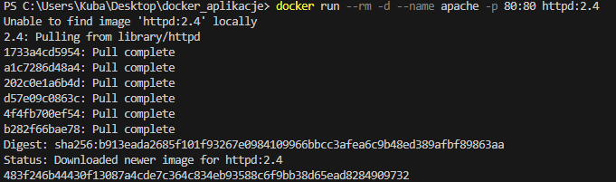


```bash
curl localhost
```
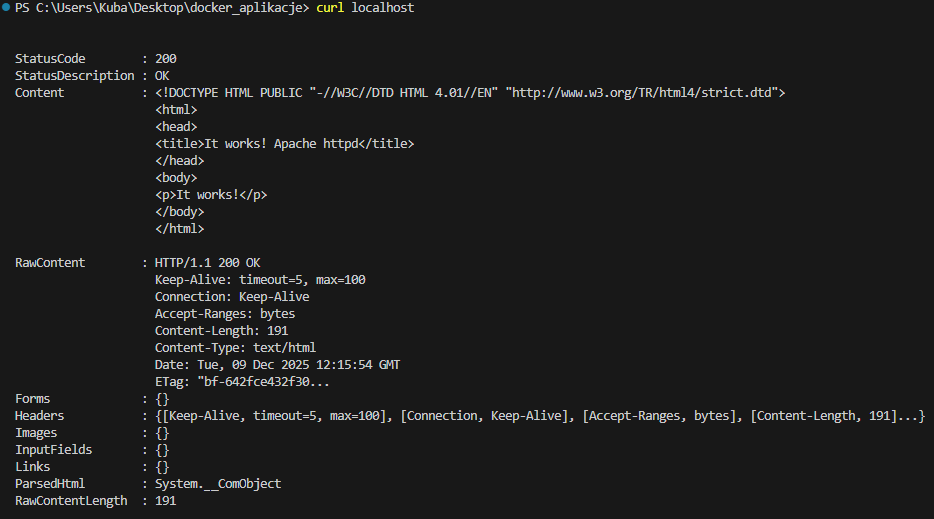


> Polecenie: `docker cp .\01-basic-docker-trainings\Cwiczenie05\index.html apache:/usr/local/apache2/htdocs/`

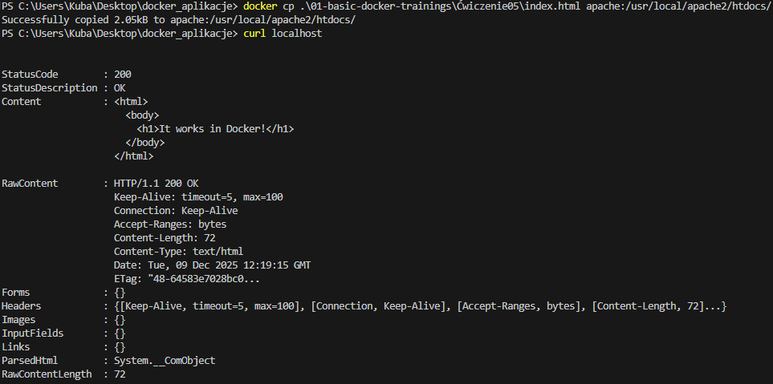

> Polecenie: `docker stop apache`

> Polecenie: `docker run --rm -d --name apache -p 80:80 httpd:2.4`

> Polecenie: `curl localhost`

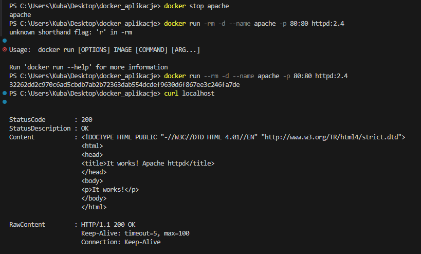

### Zarządzanie wolumenami

> Polecenie: `docker volume ls`

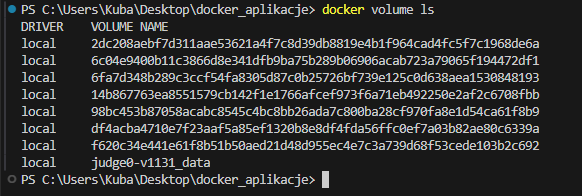

> Polecenie: `docker volume create 25083volume`

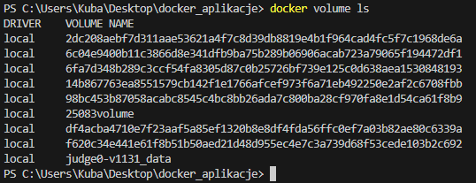

> Polecenie: `docker volume rm 25083volume`

> Polecenie: `docker volume ls`

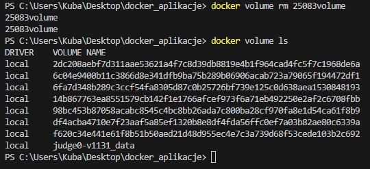


## Montowanie wolumenów w kontenerach

> Polecenie: `docker volume create httpd_htdocs`

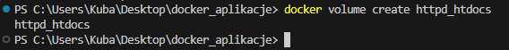

> Polecenie: `docker run --rm -d --name apache -p 80:80 -v httpd_htdocs:/usr/local/apache2/htdocs/ httpd:2.4`

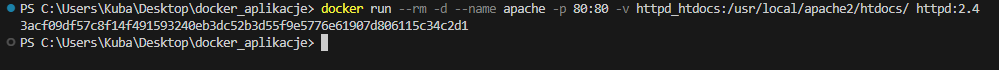

> Polecenie: `docker cp .\01-basic-docker-trainings\Cwiczenie05\index.html apache:/usr/local/apache2/htdocs/`

> Polecenie: `curl localhost`

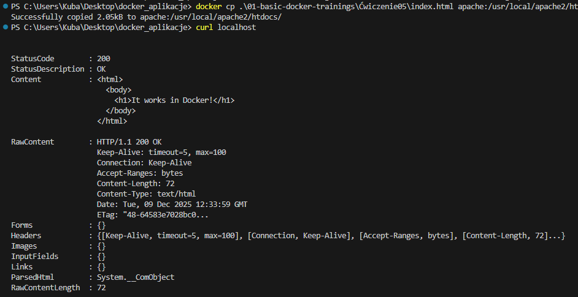

> Polecenie: `docker stop apache`

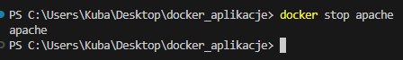

> Polecenie: `docker run --rm -d --name apache -p 80:80 -v httpd_htdocs:/usr/local/apache2/htdocs/ httpd:2.4`

```bash
curl localhost
```


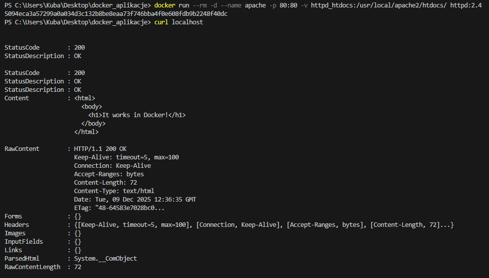

## Montowanie katalogów hosta w kontenerach

> Polecenie: `docker run --rm -d --name apache -p 80:80 -v C:\Users\Kuba\Desktop\docker_aplikacje\01-basic-docker-trainings\Cwiczenie05:/usr/local/apache2/htdocs/ httpd:2.4`


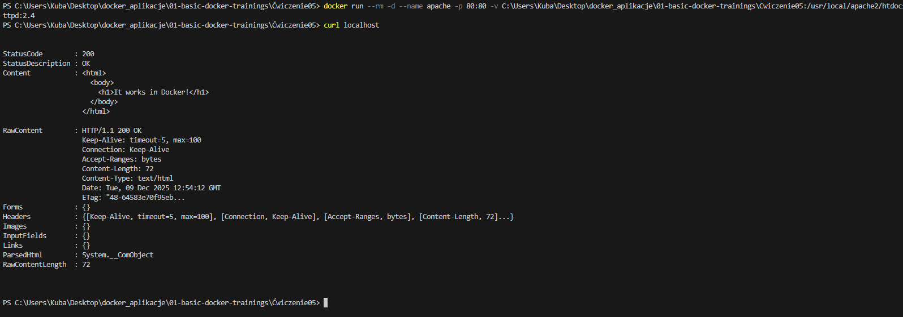

*Przed zmianą*

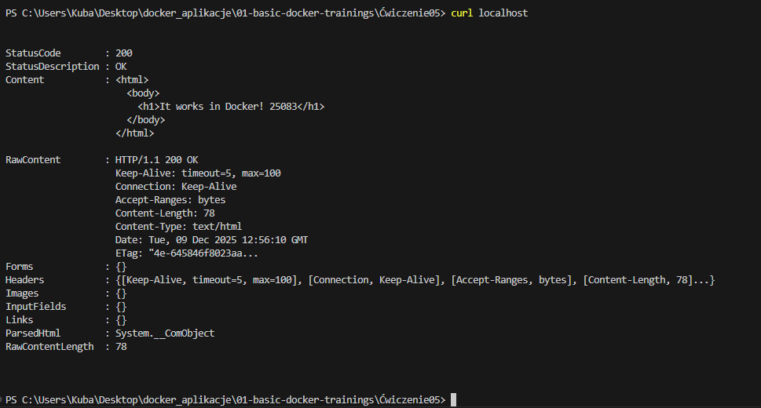

*Po zmianie*