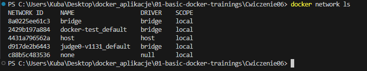
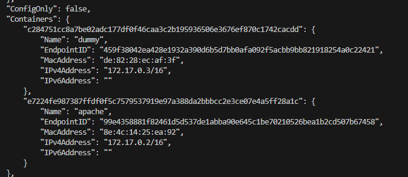
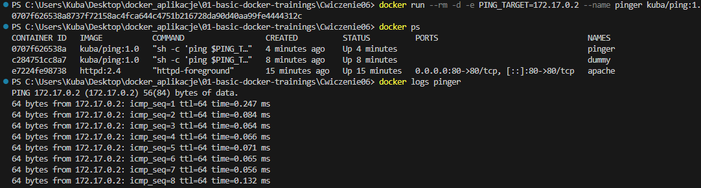
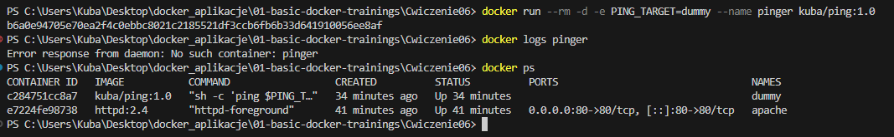
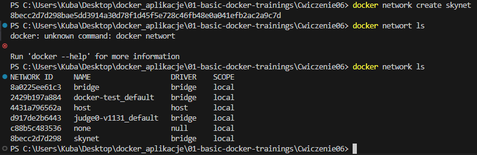
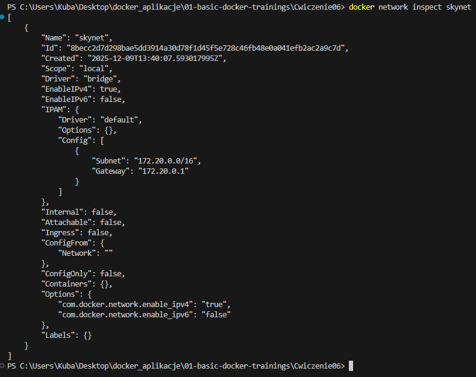
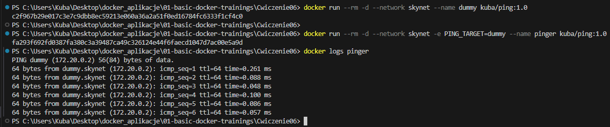
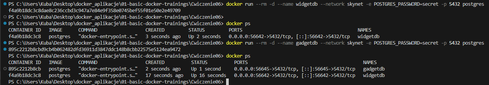
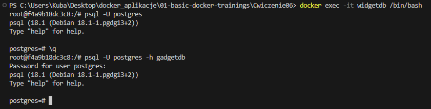
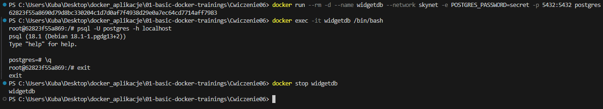

# Basic docker trainging

## Ćwiczenie 6: Sieci

### Listowanie sieci

> Polecenie: `docker network ls`



> Polecenie: `docker run --rm -d --name dummy kuba/ping:1.0`

> Polecenie: `docker network inspect bridge`



> Polecenie: `docker run --rm -d -e PING_TARGET=172.17.0.2 --name pinger delner/ping:1.0`

> Polecenie: `docker logs pinger`


*Ping po IP*


*Ping po nazwie kontenera*

### Zarządzanie sieciami własnymi

> Polecenie: `docker network create skynet`

> Polecenie: `docker network ls`




> Polecenie: `docker run --rm -d --network skynet --name dummy delner/ping:1.0`

> Polecenie: `docker run --rm -d --network skynet -e PING_TARGET=dummy --name pinger delner/ping:1.0`

> Polecenie: `docker logs pinger`



### Połączenia między kontenerami w sieci

> Polecenie: `docker run --rm -d --name widgetdb --network skynet -e POSTGRES_PASSWORD=secret -p 5432 postgres`

> Polecenie: `docker run --rm -d --name gadgetdb --network skynet -e POSTGRES_PASSWORD=secret -p 5432 postgres`



> Polecenie: `docker exec -it widgetdb /bin/bash`

```bash
psql -U postgres
\q
```
```bash
psql -U postgres -h gadgetdb
\q
```



### Mapowanie portów na hosta


> Polecenie: `docker run --rm -d --name widgetdb --network skynet -e POSTGRES_PASSWORD=secret -p 5432:5432 postgres`

> Polecenie `docker exec -it widgetdb /bin/bash`

```bash
psql -U postgres -h localhost
\q
```
