# Basic docker trainging

## Ćwiczenie 1: Uruchamianie kontenerów

### Pobieranie obrazu


> Polecenie: `docker images`

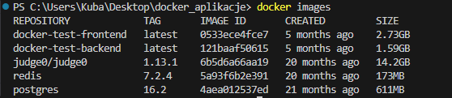

> Polecenie: `docker search ubuntu`

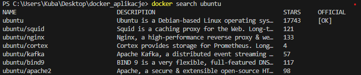

> Polecenie: `docker pull ubuntu:22.04`

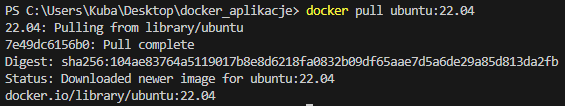

> Polecenie: `docker images`

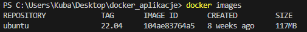


> Polecenie: `docker rmi 104ae83764a5`

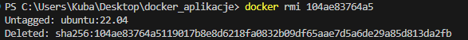

> Polecenie: `docker images`

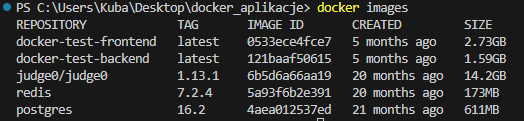


--- 

### Uruchamainie kontenerów

> Polecenie: `docker run -it --name ubuntu-shell ubuntu:22.04 /bin/bash`

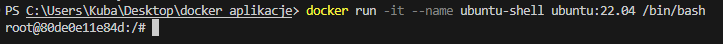


```bash
ls pwd exit
```

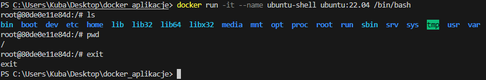


> Polecenie: `docker ps -a`

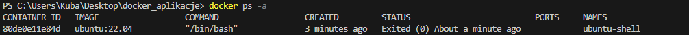

> Polecenie: `docker start -i ubuntu-shell`

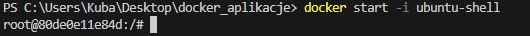

> Polecenie: `docker stop ubuntu-shell`

> Polecenie: `docker rm ubuntu-shell`

> Polecenie: `docker ps -a`


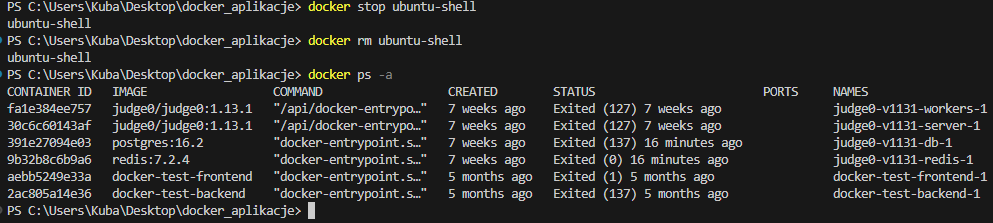
