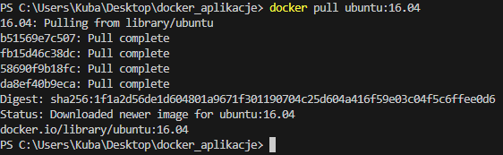
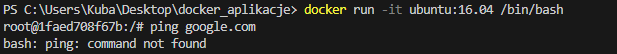
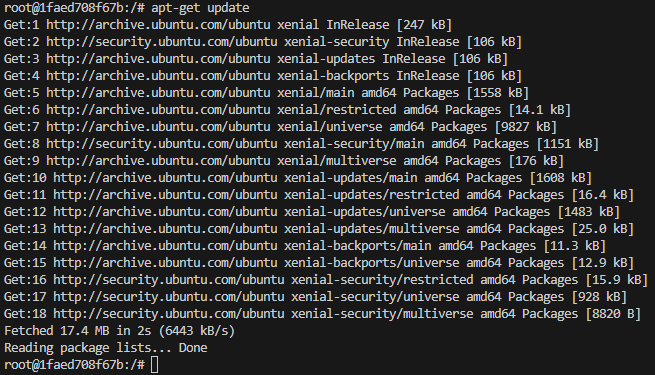
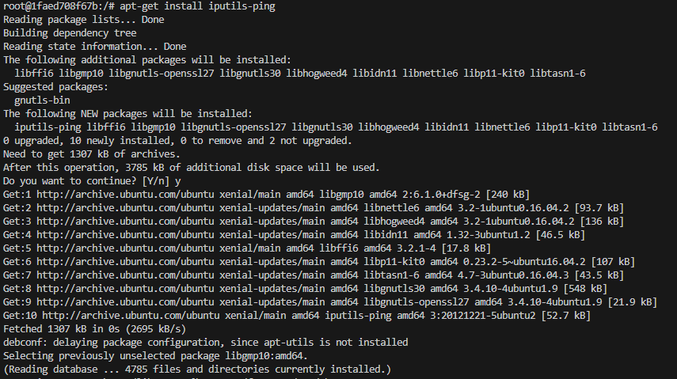
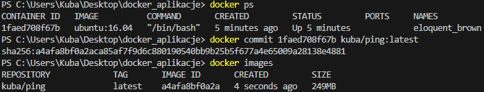
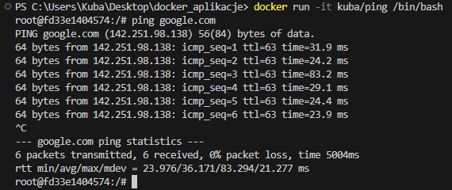

# Basic docker trainging

## Ćwiczenie 2: Zmiana obrazów

### Przygotowanie środowiska

> Polecenie: `docker pull ubuntu:16.04`




> Polecenie: `docker run -it ubuntu:16.04 /bin/bash`

```bash
ping google.com
```



```bash
apt-get update
```



```bash
apt-get install iputils-ping
```




> Polecenie: `docker ps`

> Polecenie: ` docker commit 1faed708f67b kuba/ping:lates`

> Polecenie: `docker images`





> Polecenie: `docker run -it kuba/ping /bin/bash`

```bash
ping google.com
```


