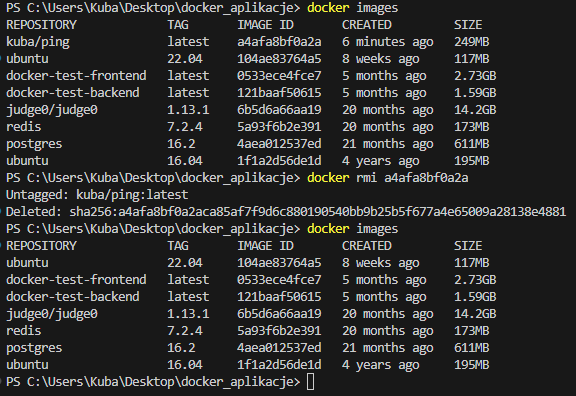
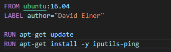
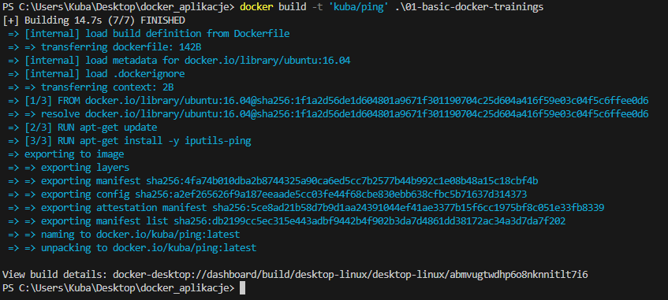
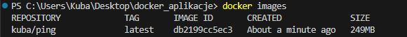
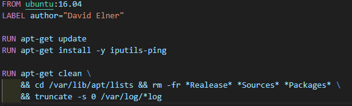
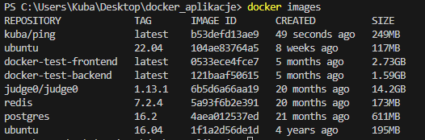
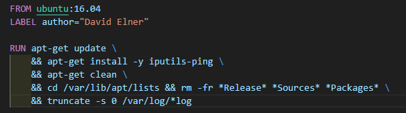
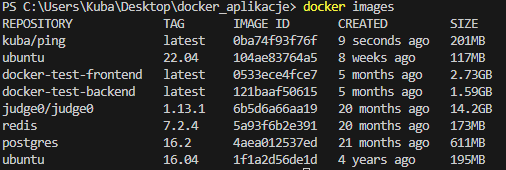

# Basic docker trainging

## Ćwiczenie 3: Budowanie obrazów

### Przygotowanie

> Polecenie: `docker build -t 'kuba/ping' .\01-basic-docker-trainings`

### Optymalizacja Dockerfile

*Brak poprawy*

***

*Poprawawa różnica 6MB*
