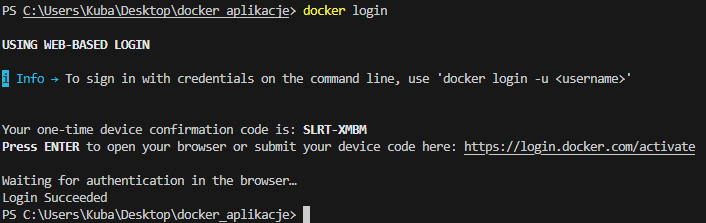
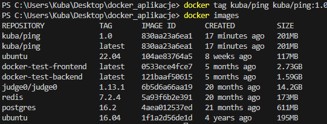
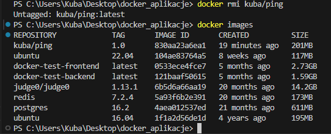

# Basic docker trainging

## Ćwiczenie 4: Udostępnianie obrazów

### Pierwsze kroki

> Polecenie: `docker login`

### Tagowanie obrazów

> Polecenie: `docker tag kuba/ping kuba/ping:1.0`

> Polecenie: `docker images`

> Polecenie: `docker rmi kuba/ping`

> Polecenie: `docker images`

### Wysyłanie obrazów (push)

> Polecenie: `docker push masalski22/ping:1.0`

[Dockerhub](https://hub.docker.com/r/masalski22/ping)
