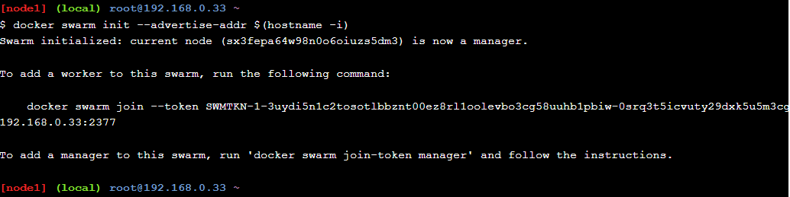
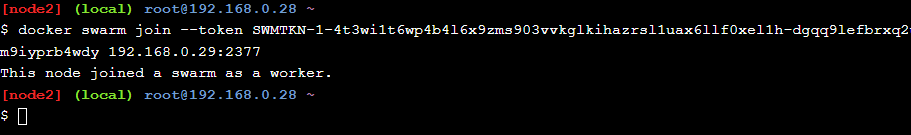
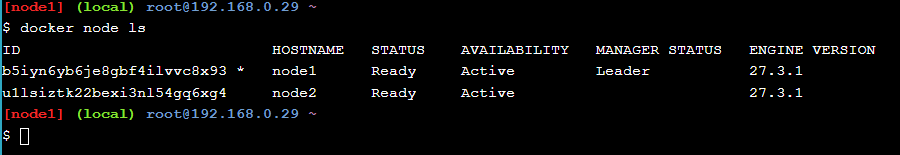
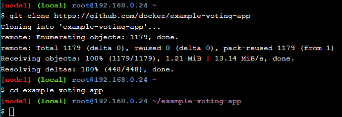
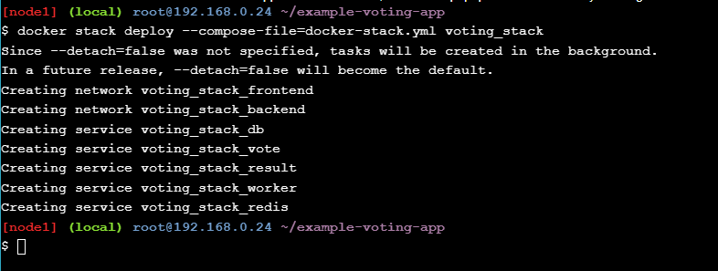
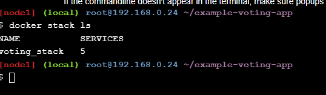
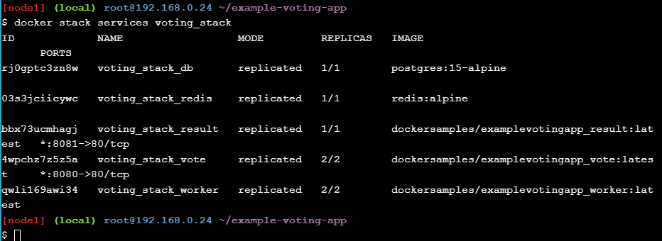
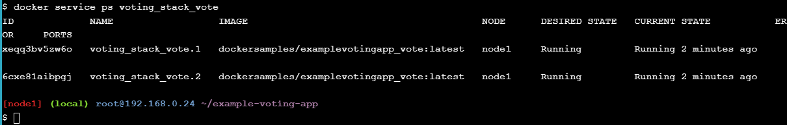
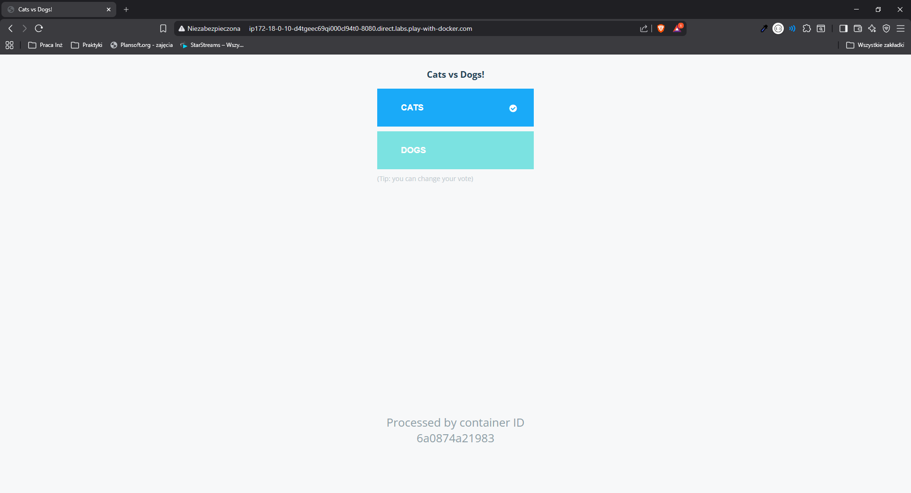

### Init your swarm

> Polecenie `docker swarm init --advertise-addr $(hostname -i)`


> Polecenie `docker swarm join --token SWMTKN-1-4t3wi1t6wp4b4l6x9zms903vvkglkihazrsl1uax6llf0xel1h-dgqq9lefbrxq2um9iyprb4wdy 192.168.0.29:2377)`


### Show members of swarm

> Polecenie `docker node ls`



### Clone the voting-app

Polecenie :
```
git clone https://github.com/docker/example-voting-app

cd example-voting-app
```



### Deploy a stack

> Polecenie `docker stack deploy --compose-file=docker-stack.yml voting_stack`



> Polecenie `docker stack ls`



> Polecenie `docker stack services voting_stack`



> Polecenie `docker stack ps voting_stack`





*Z 3 linków uruchamia sie tylko aplikacja do głosowania, swarm visualizer oraz result nie działają*