# Task 0: Prerequisites

> Polecenie: `git clone https://github.com/dockersamples/linux_tweet_app`

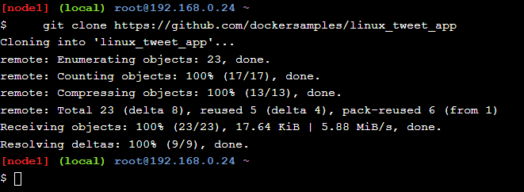

# Task 1: Run some simple Docker containers

### Run a single task in an Alpine Linux containe

> Polecenie: `docker container run alpine hostname`

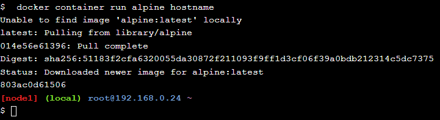

> Polecenie: `docker container ls --all`

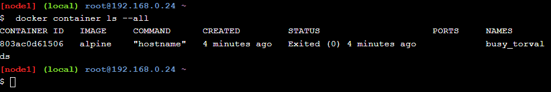

### Run an interactive Ubuntu container

> Polecenie: `docker container run --interactive --tty --rm ubuntu bash`

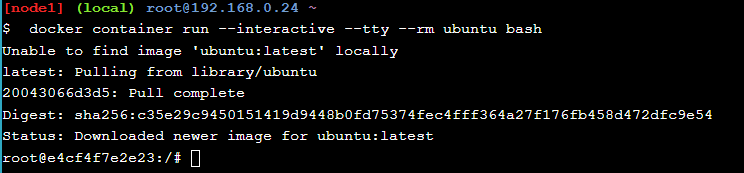

Polecenie:
```
ls /
ps aux
cat /etc/issue
```

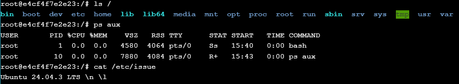

Polecenie:
```
exit
cat /etc/issue
```
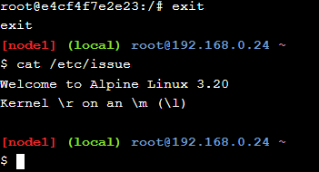

### Run a background MySQL container

Polecenie 
``` 
docker container run \
--detach \
--name mydb \
-e MYSQL_ROOT_PASSWORD=my-secret-pw \
mysql:latest

docker container ls
```

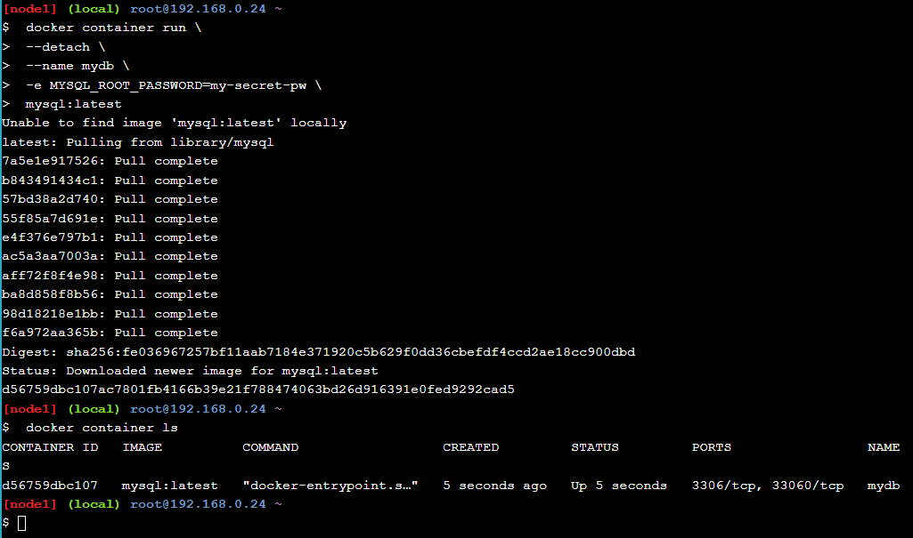

> Polecenie: `docker container logs mydb`

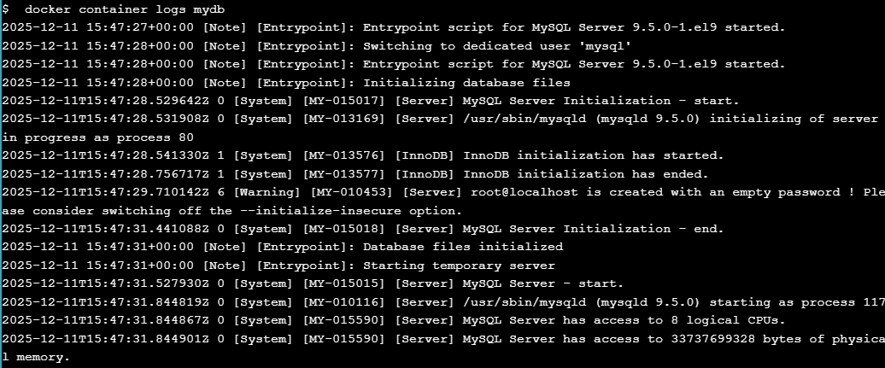

> Polecenie: `docker container top mydb`

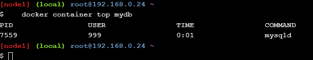

> Polecenie: `docker exec -it mydb \
 mysql --user=root --password=$MYSQL_ROOT_PASSWORD --version`

Polecenie:
```
docker exec -it mydb sh
mysql --user=root --password=$MYSQL_ROOT_PASSWORD --version
exit
```
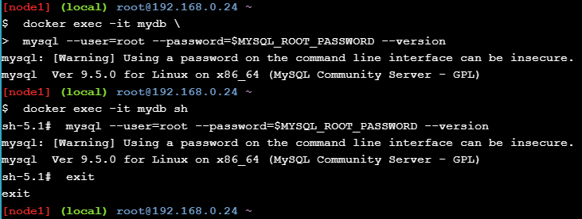

# Task 2: Package and run a custom app using Docker

### Build a simple website image

> Polecenie: `cd ~/linux_tweet_app cat Dockerfile`

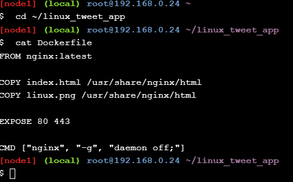


Polecenie: 
```
export DOCKERID=masalski22
docker image build --tag $DOCKERID/linux_tweet_app:1.0 .
```

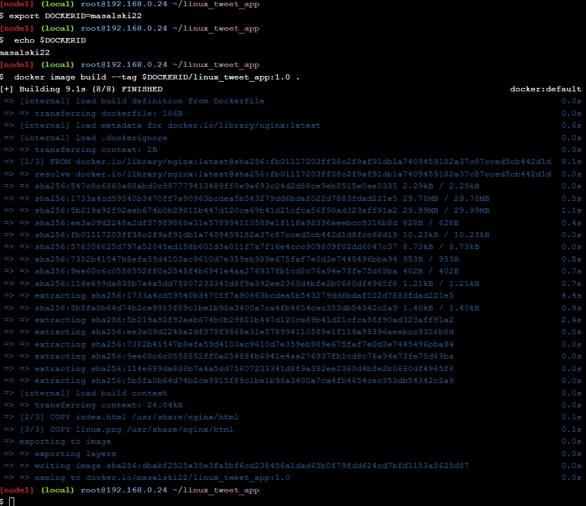


Polecenie: 
``` 
docker container run \
--detach \
--publish 80:80 \
--name linux_tweet_app \
$DOCKERID/linux_tweet_app:1.0
```
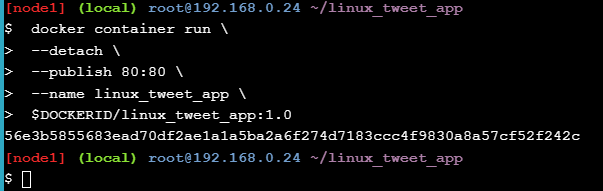
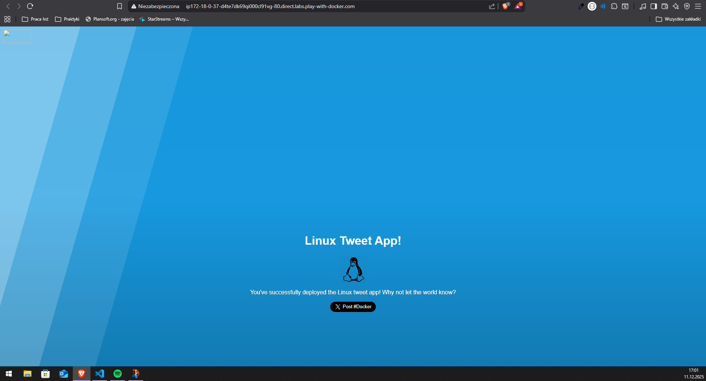

# Task 3: Modify a running website

### Start our web app with a bind mount

Polecenie: 
``` 
docker container run \
--detach \
--publish 80:80 \
--name linux_tweet_app \
--mount type=bind,source="$(pwd)",target=/usr/share/nginx/html \
$DOCKERID/linux_tweet_app:1.0
```

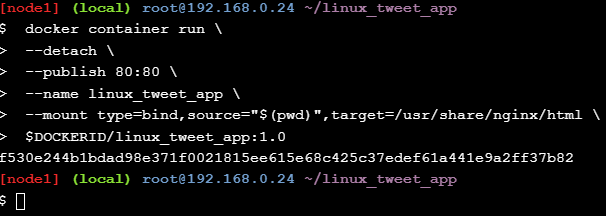
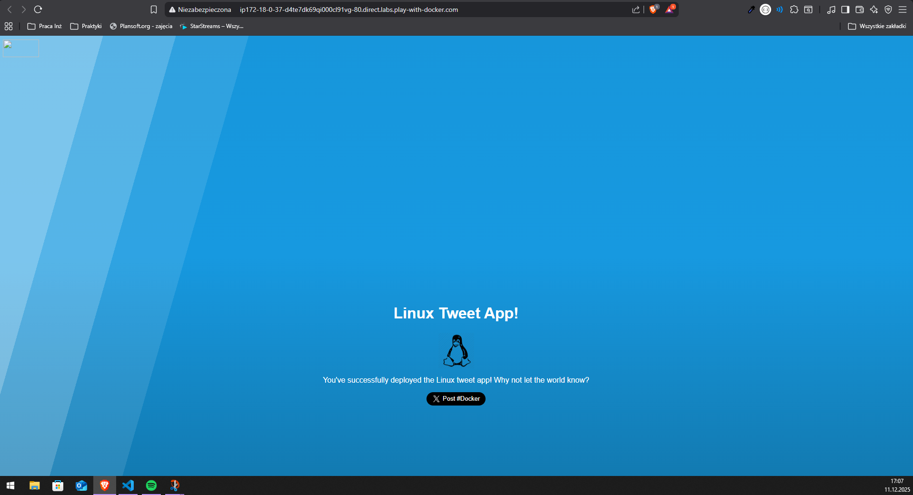

### Modify the running website

Polecenie
```
docker container run \
--detach \
--publish 80:80 \
--name linux_tweet_app \
--mount type=bind,source="$(pwd)",target=/usr/share/nginx/html \
$DOCKERID/linux_tweet_app:1.0

cp index-new.html index.html
```

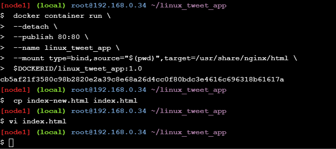

W vi edytowałem jeszcze samemu plik index.html

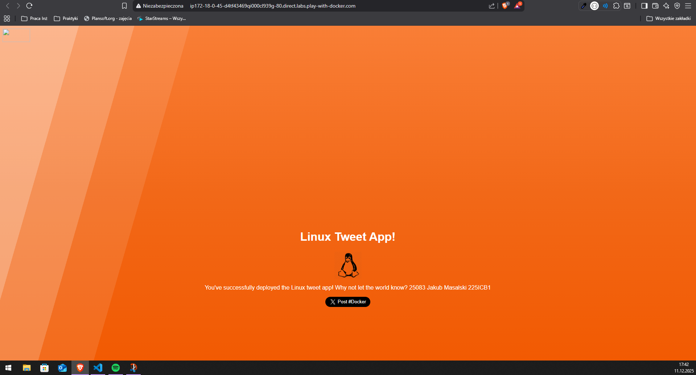

Polecenie
```
docker rm --force linux_tweet_app

docker container run \
--detach \
--publish 80:80 \
--name linux_tweet_app \
$DOCKERID/linux_tweet_app:1.0
```

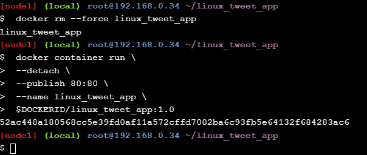
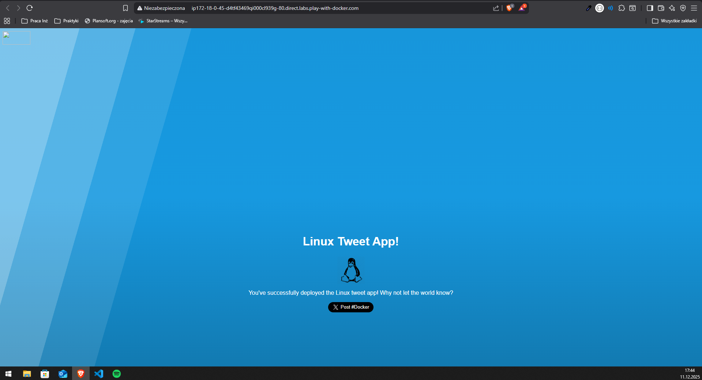

### Update the image

Polecenie
```
docker image build --tag $DOCKERID/linux_tweet_app:2.0 .

docker image ls
```

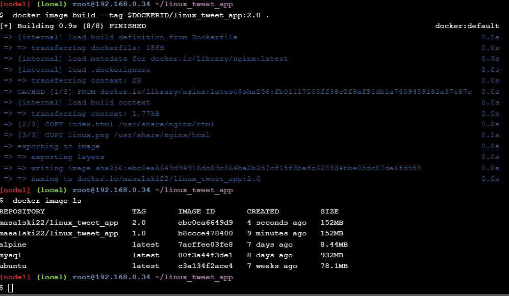


### Test the new version

Polecenie
```
docker container run \
--detach \
--publish 80:80 \
--name linux_tweet_app \
$DOCKERID/linux_tweet_app:2.0

docker container run \
--detach \
--publish 8080:80 \
--name old_linux_tweet_app \
$DOCKERID/linux_tweet_app:1.0
```

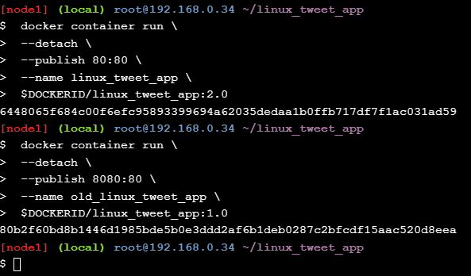
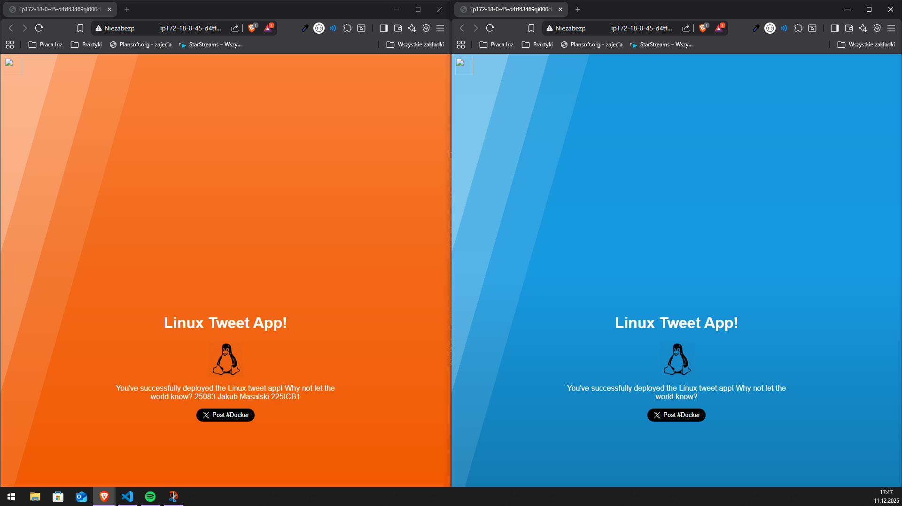

### Push your images to Docker Hub

Polecenie
```
docker image ls -f reference="$DOCKERID/*"

docker login
```

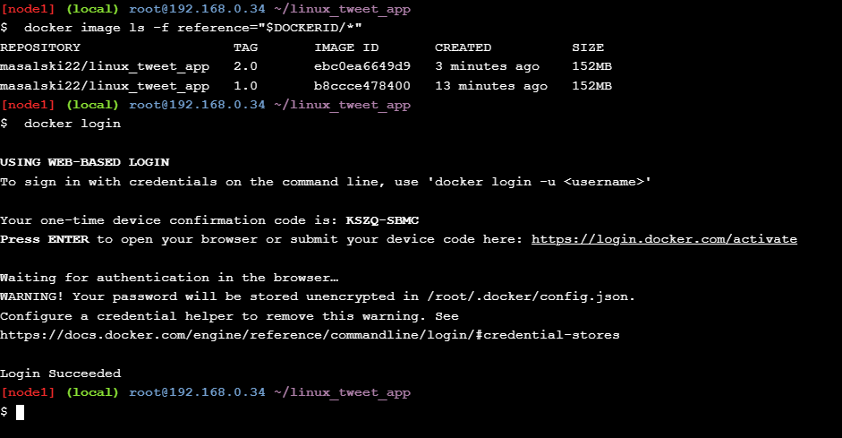

Polecenie
```
docker image push $DOCKERID/linux_tweet_app:1.0

docker image push $DOCKERID/linux_tweet_app:2.0
```

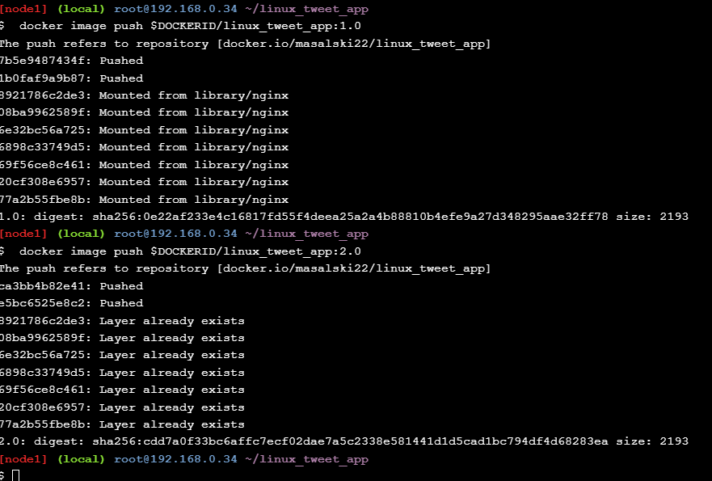

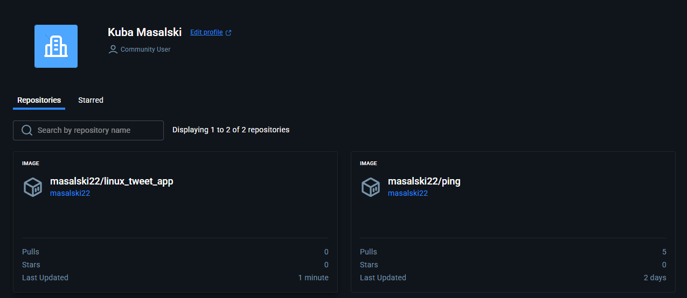

[Dockerhub](https://hub.docker.com/r/masalski22/linux_tweet_app)