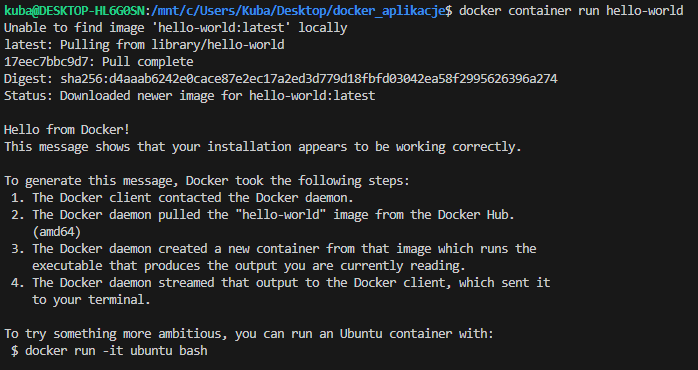
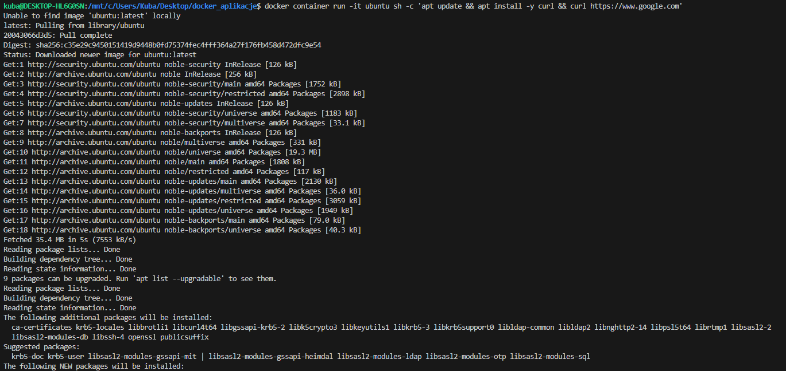
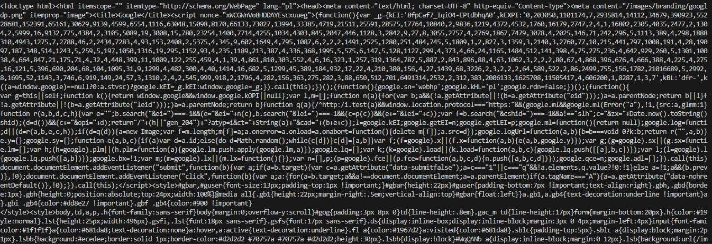
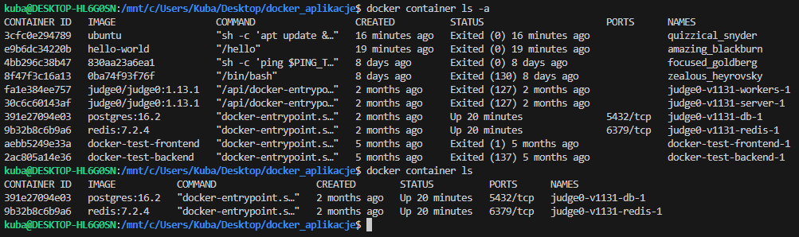
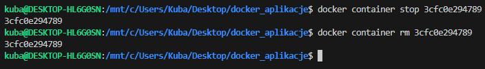
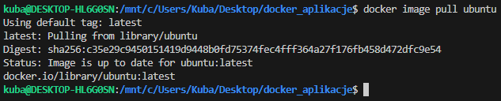
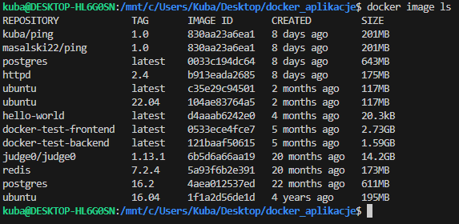
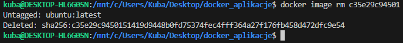

# Sekcja 1

### Uruchamianie kontenerów

> Polecenie: `docker container run hello-world`

### Obrazy (images)

> Polecenie: `docker container run -it ubuntu sh -c 'apt update && apt install -y curl && curl https://www.google.com'`

### Zarządzanie kontenerami

> Polecenie: `docker container ls -a`

> Polecenie: `docker container ls`

> Polecenie: `docker container stop 3cfc0e294789`

> Polecenie: `docker container rm 3cfc0e294789`

> Polecenie : `docker image pull ubuntu`

> Polecenie : `docker image ls`

> Polecenie : `docker image rm c35e29c94501`

