# Seckja 2

### Uruchamianie i zatrzymywanie kontenerów

> Polecenie: `docker run ubuntu`

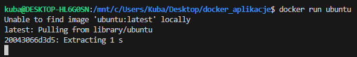

> Polecenie: `docker run -t ubuntu`

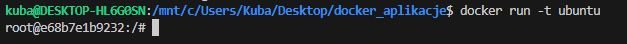

> Polecenie: `docker run -it ubuntu`

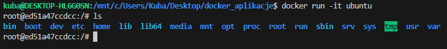

> Polecenie : `docker run -d -it --name looper ubuntu sh -c 'while true; do date; sleep 1; done'`

>Polecenie: `docker logs -f looper` 

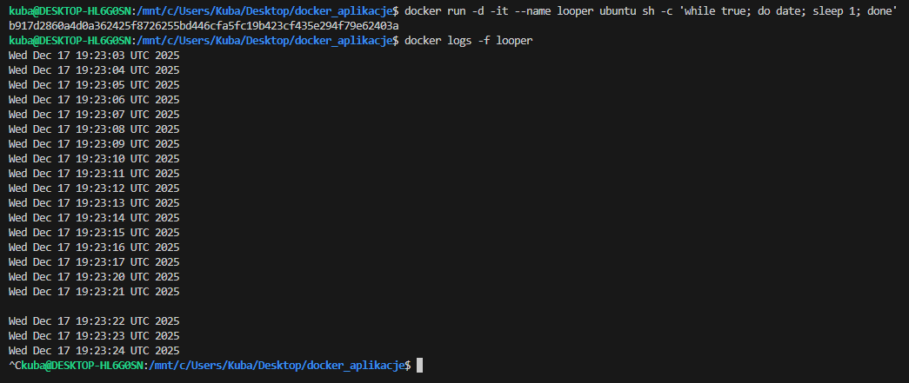

>Polecenie: `docker pause looper` 

>Polecenie: `docker unpause looper` 

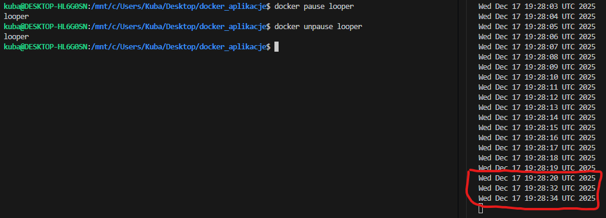

>Polecenie: `docker attach looper` 

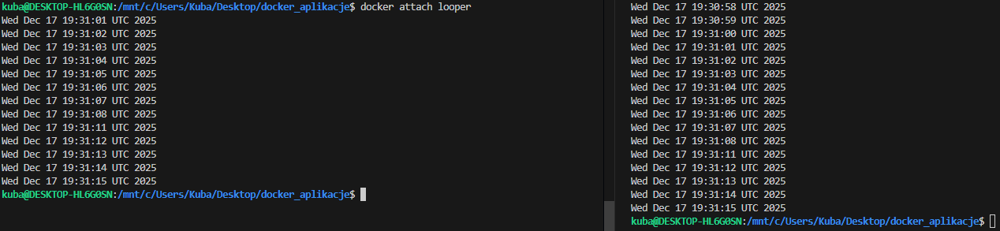

>Polecenie: `docker attach --no-stdin looper` 

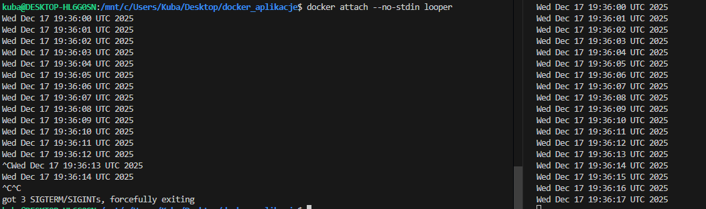

### Uruchamianie procesów w kontenerze za pomocą docker exec

>Polecenie: `docker exec looper ls -la` 

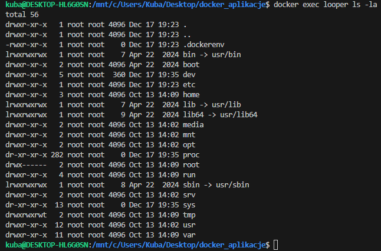

>Polecenie: `docker exec -it looper bash` 

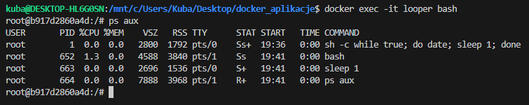

>Polecenie: `docker kill looper` 

>Polecenie: `docker rm looper`

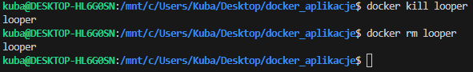

### Ćwiczenie 1.3

> Polecenie : `docker run --name task devopsdockeruh/simple-web-service:ubuntuimple-web-service:ubuntu`

> Polecenie :`docker exec -it task bash`

> Polecenie :`tail -f ./text.log`

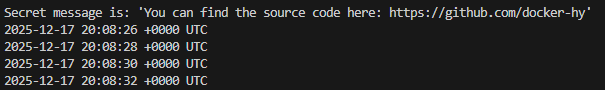

### Ubuntu w kontenerze to po prostu... Ubuntu
> Polecenie :`docker run -it ubuntu`

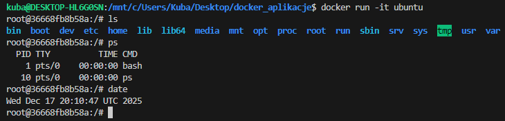

> Polecenie :`apt-get update`

> Polecenie : `apt-get -y install nano`

> Polecenie : `cd tmp/`

> Polecenie : `nano temp_file.txt`

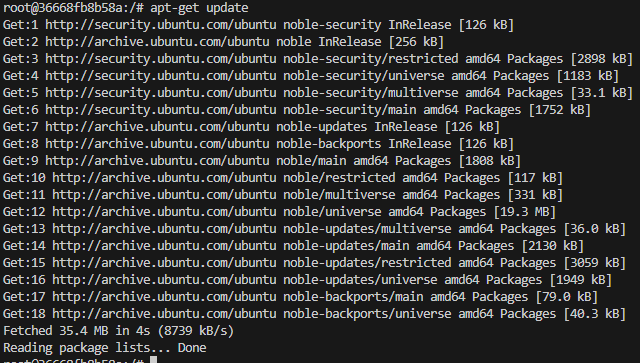

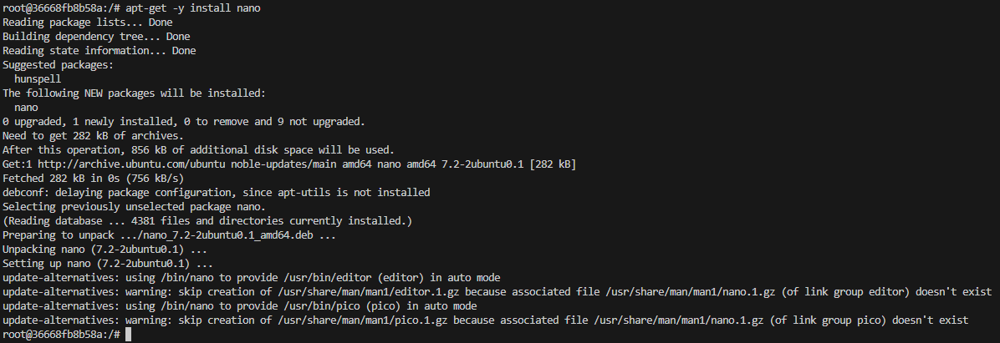

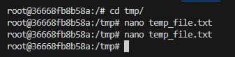
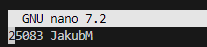

### Ćwiczenie 1.4

> Polecenie : `docker exec -it task2 bash`

> Polecenie : `sudo apt update`

> Polecenie : `sudo apt install curl`

> Polecenie : `docker run -it --name task2 ubuntu sh -c 'while true; do echo "Input website:"; read website; echo "Searching.."; sleep 1; curl http://$website; done'`

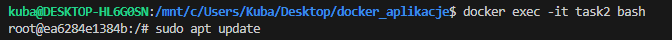
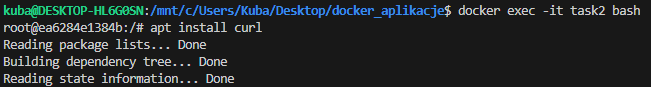
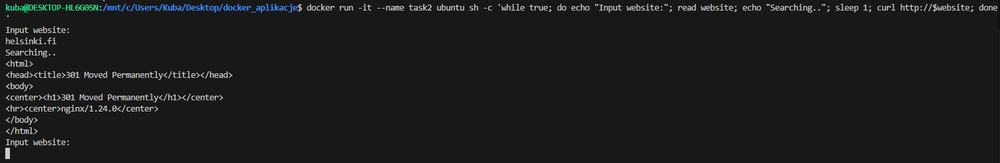
