# Sekcja 3

### Skąd biorą się obrazy?

> Polecenie : `docker search hello-world`

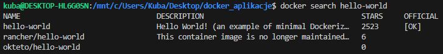

### Szczegółowe spojrzenie na obraz

> Polecenie : `docker pull ubuntu`

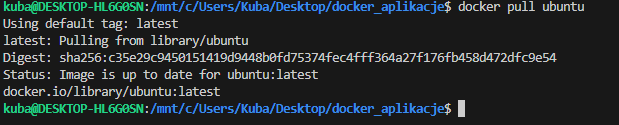

> Polecenie : `docker pull ubuntu:22.04`

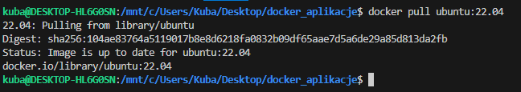

> Polecenie : `docker tag ubuntu:22.04 fav_distro:jammy_jellyfish `

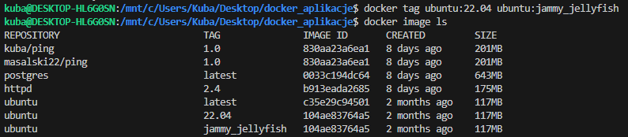

### Ćwiczenie 1.5

> Polecenie : `docker pull devopsdockeruh/simple-web-service:alpine `

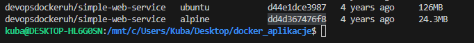

> Polecenie : `docker run -it devopsdockeruh/simple-web-service:alpine`

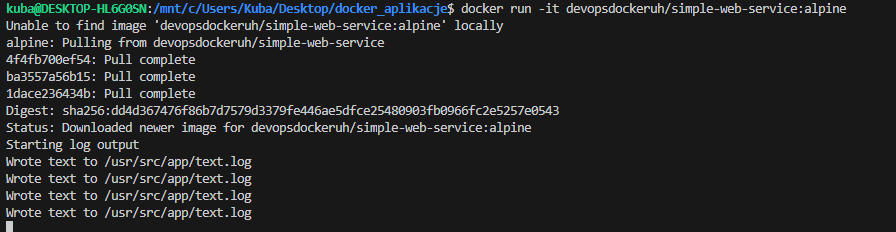

> Polecenie : `docker ps`

> Polecenie : `docker exec -it awesome_chebyshev sh`

> Polecenie : `tail -f ./text.log`

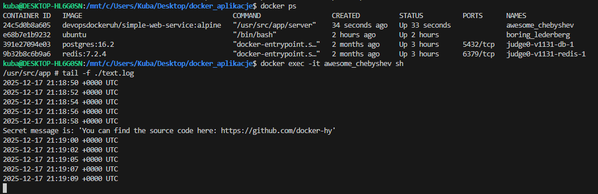

### Ćwiczenie 1.6

> Polecenie : `docker run -it devopsdockeruh/pull_exercise`

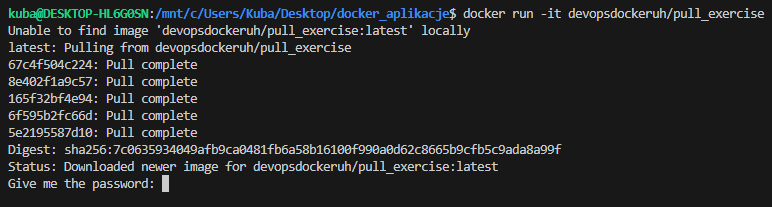

> Polecenie : `docker exec -it happy_joliot sh`

> Polecenie : `ls`

> Polecenie : `cat index.js`

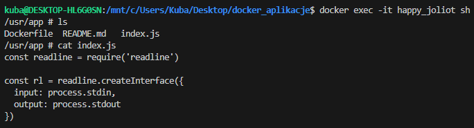
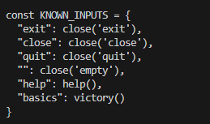

> Polecenie : `basics`

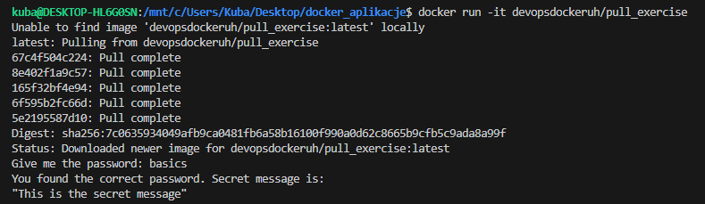

### Budowanie obrazów

- [Skrypt](./hello.sh)

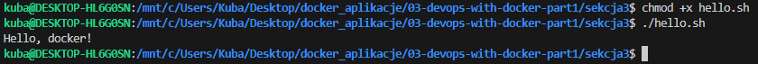

- [Dockerfile](./Dockerfile.budowanie)

> Polecenie: `docker build . -t hello-docker`
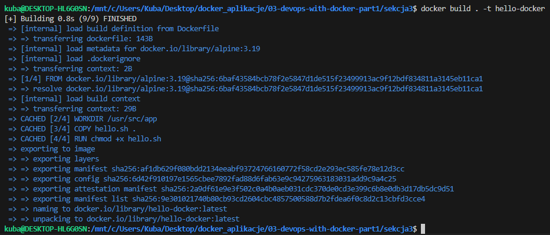

> Polecenie: `docker image ls`

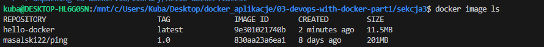

> Polecenie: `docker run hello-docker`

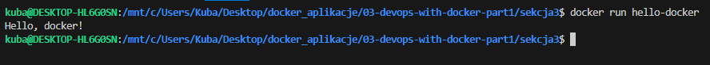

> Polecenie: `docker run -it hello-docker sh`
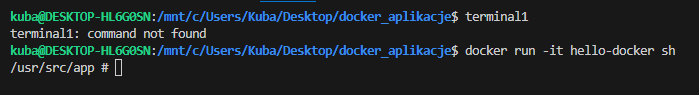

> Polecenie: `docker ps`

> Polecenie: `touch additional.txt`

> Polecenie : `docker cp ./additional.txt silly_pare:/usr/src/app/`

> Polecenie : `ls`

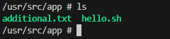

> Polecenie :  `docker diff silly_pare`

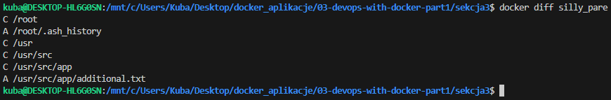

> Polecenie :  `docker commit silly_pare hello-docker-additional`

> Polecenie :  `docker image ls`

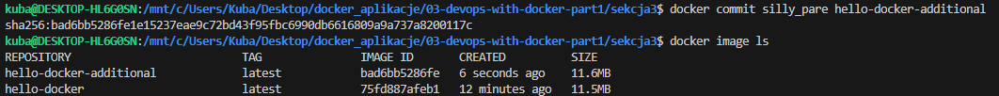

> Polecenie :  `docker build . -t hello-docker:v2`

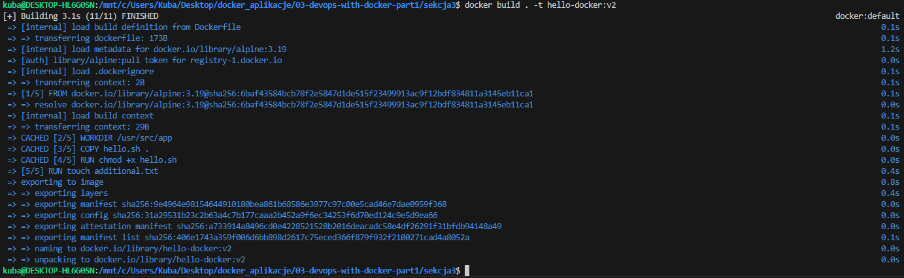

> Polecenie :  `docker run hello-docker-additional ls`

> Polecenie :  `docker run hello-docker:v2 ls` 

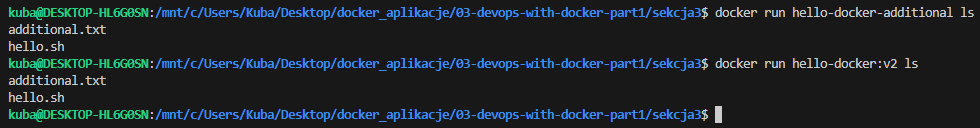

### Ćwiczenie 1.7

[Dockerfile](Dockerfile.cw)

[Skrypt](script.sh)

> Polecenie :  `docker build -f ./Dockerfile.cw -t curler .` 

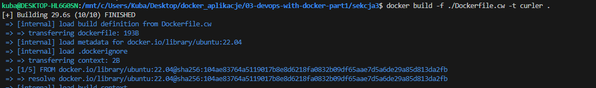

> Polecenie :  `docker run -it curler` 

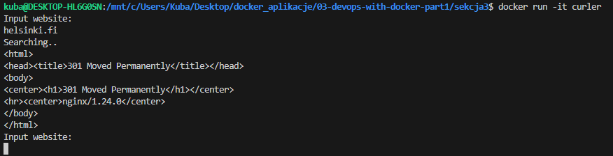

### Ćwiczenie 1.8

[Dockerfile](Dockerfile.cw2)

> Polecenie :  `docker build -f ./Dockerfile.cw2 -t web-server .`

> Polecenie : `docker run web-server`

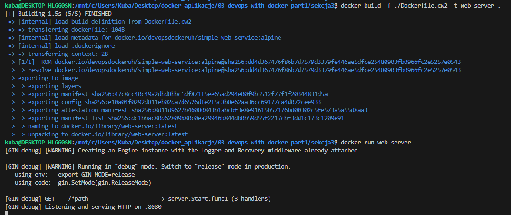
