# Sekcja 4

### Definiowanie warunków startowych kontenera

> Polecenie: `docker run -it ubuntu:22.04`

> Polecenie: `curl -L https://github.com/yt-dlp/yt-dlp/releases/latest/download/yt-dlp -o /usr/local/bin/yt-dlp` 

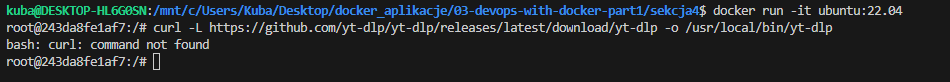

> Polecenie : `apt-get update && apt-get install -y curl`

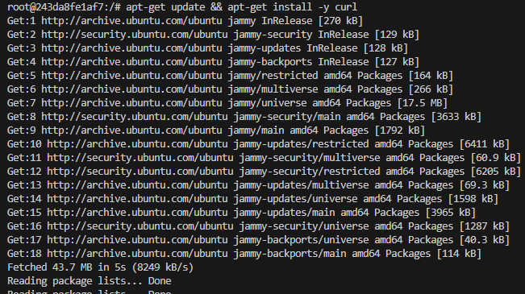

> Polecenie: `curl -L https://github.com/yt-dlp/yt-dlp/releases/latest/download/yt-dlp -o /usr/local/bin/yt-dlp` 

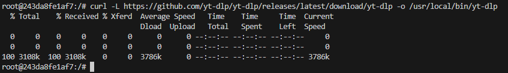

> Polecenie: `chmod a+rx /usr/local/bin/yt-dlp` 

> Polecenie: `yt-dlp` 

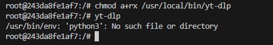

> Polecenie: `apt-get install -y python3` 

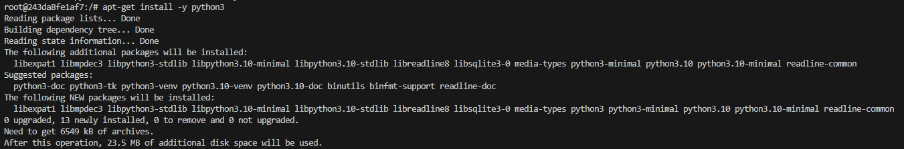

[Dockerfile](Dockerfile.1)

> Polecenie: `docker build -f Dockerfile.1 -t yt-dlp .` 

> Polecenie: `docker run yt-dlp`

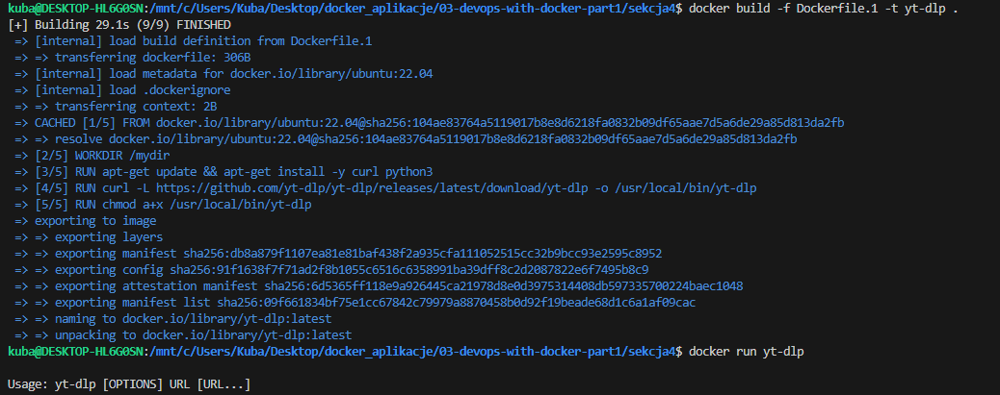

> Polecenie : `docker run yt-dlp https://www.youtube.com/watch?v=XsqlHHTGQrw`

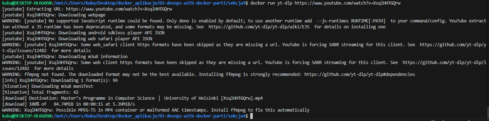

> Polecenie : `docker run yt-dlp`

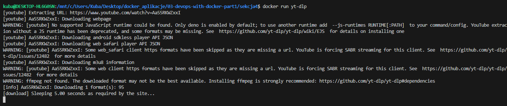

> Polecenie : `docker pull python:3.11`

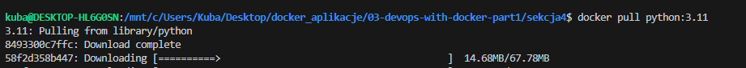

> Polecenie : `docker run -it python:3.11`

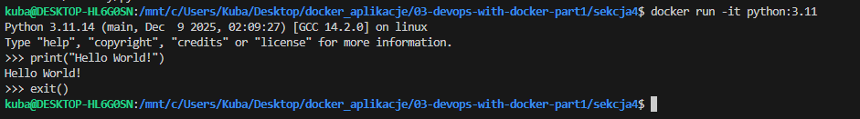

> Polecenie : `docker run -it python:3.11 --version`

> Polecenie : `docker run -it python:3.11 bash`

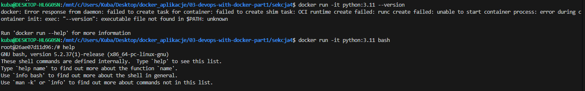

> Polecenie : `docker container ls -a`

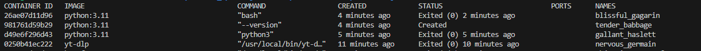

> Polecenie : `docker diff nervous_germain`
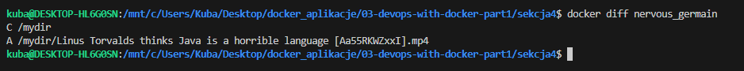

> Polecenie : `docker cp "nervous_germain://mydir/Linus Torvalds thinks Java is a horrible language [Aa55RKWZxxI].mp4" .`

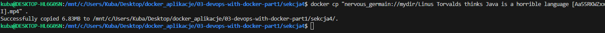

### Ulepszony curler
[Skrypt](script.sh)

[Dockerfile](Dockerfile.3)

> Polecenie `docker build . -t curler-v2`

> Polecenie `docker run curler-v2 helsinki.fi`

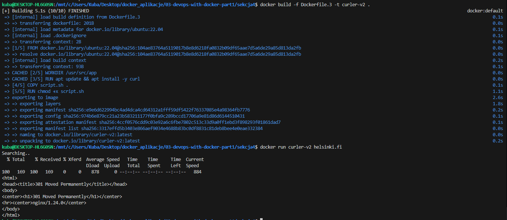
