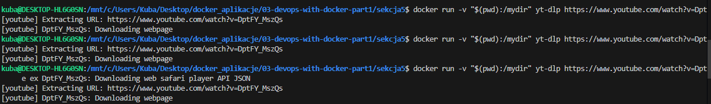
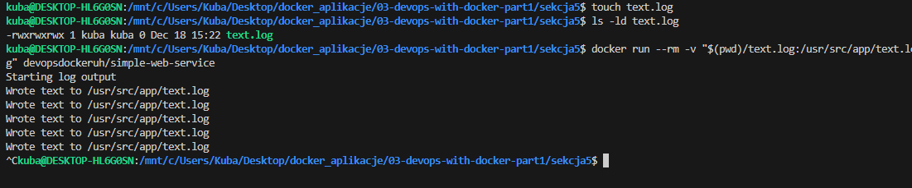
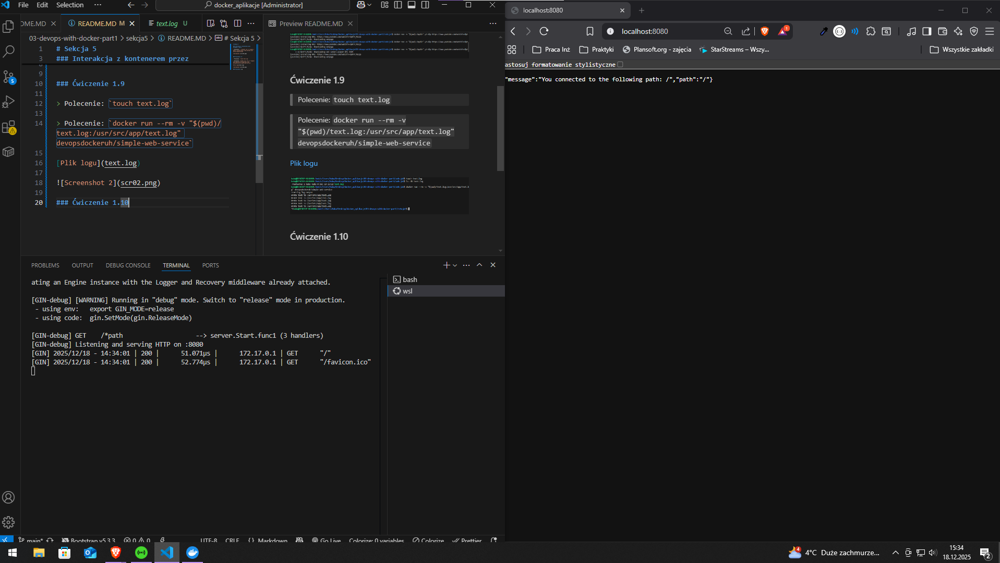

# Sekcja 5

### Interakcja z kontenerem przez wolumeny i porty

> Polecenie : `$ docker run -v "$(pwd):/mydir" yt-dlp https://www.youtube.com/watch?v=DptFY_MszQs`

### Ćwiczenie 1.9

> Polecenie: `touch text.log`

> Polecenie: `docker run --rm -v "$(pwd)/text.log:/usr/src/app/text.log" devopsdockeruh/simple-web-service`

[Plik logu](text.log)

### Ćwiczenie 1.10
> Polecenie: `docker run -p 8080:8080 devopsdockeruh/simple-web-service server`

