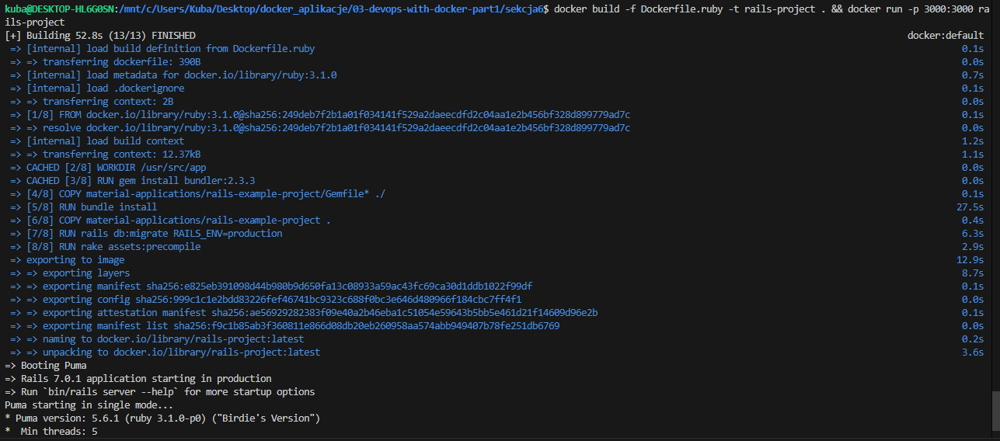
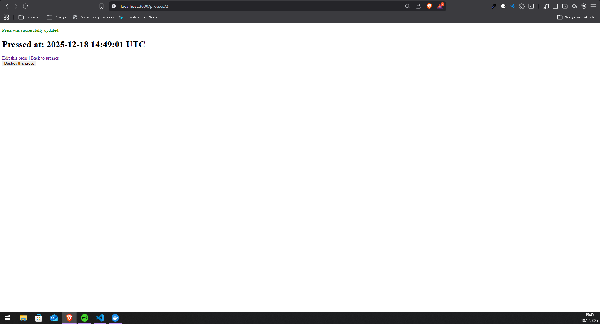
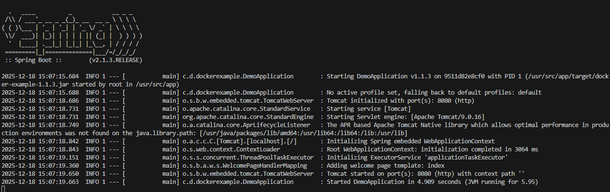
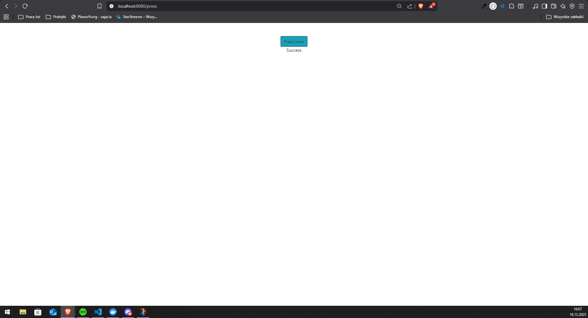
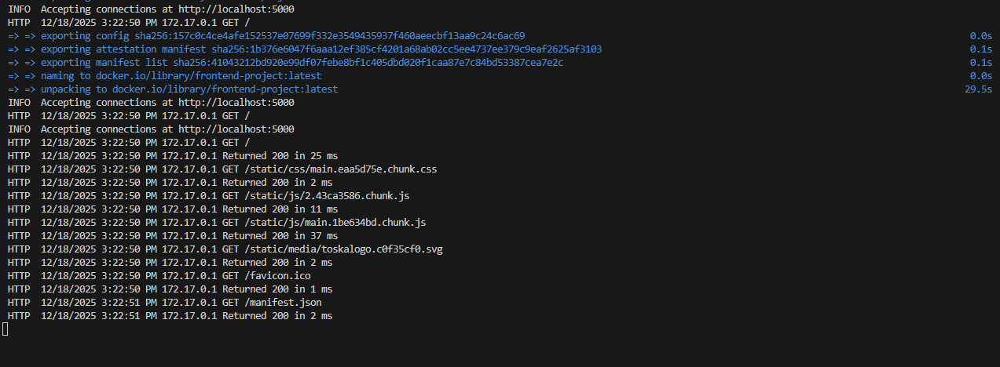
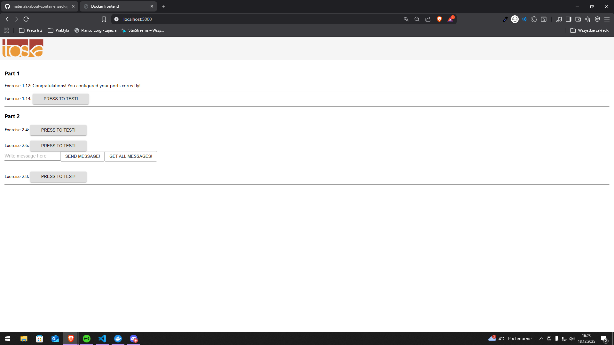
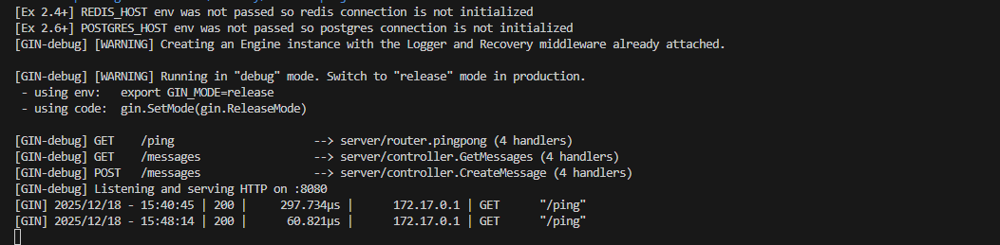
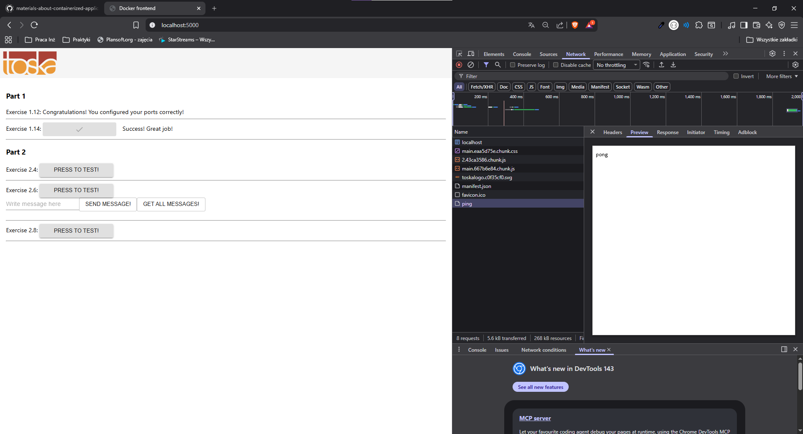
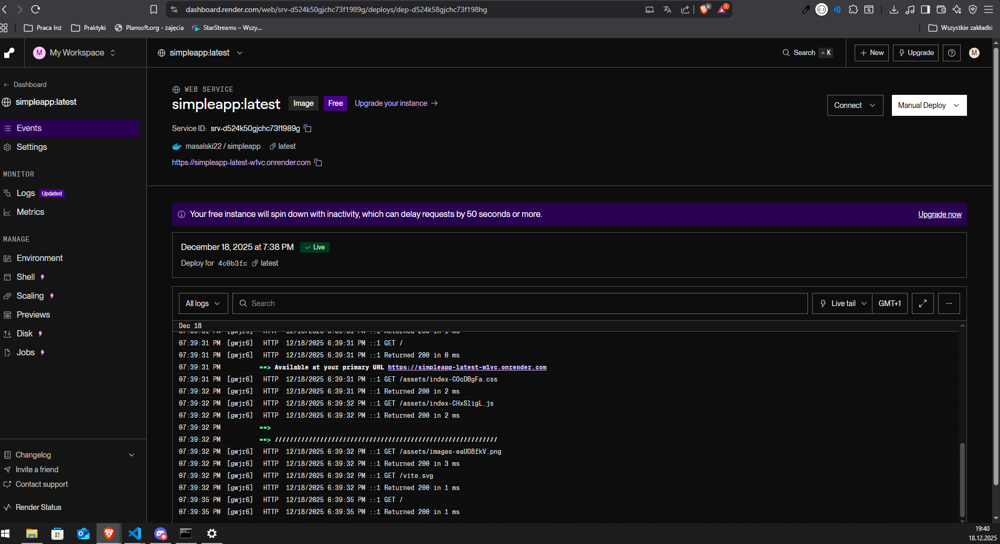
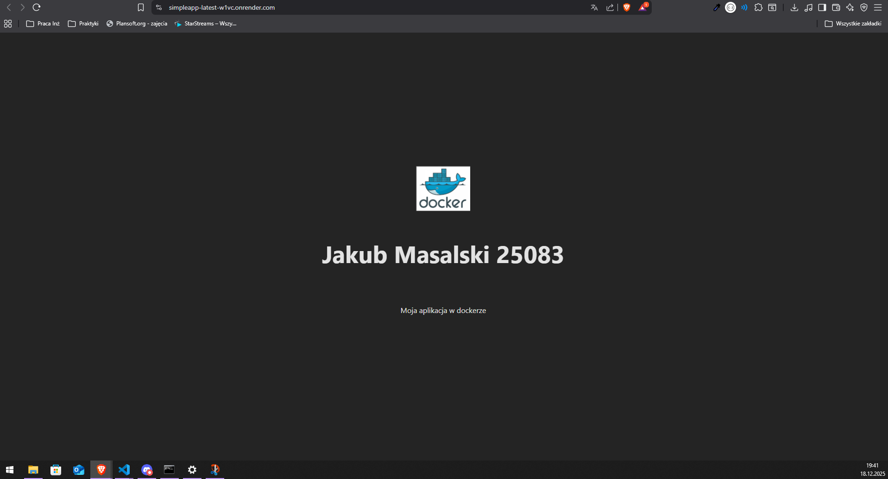

# Sekcja 6

### Wykorzystywanie narzędzi z rejestru

> Polecenie :`docker build -f Dockerfile.ruby -t rails-project . && docker run -p 3000:3000 rails-project`

[Dockerfile.ruby](Dockerfile.ruby)

## Ćwiczenia 1.11-1.14

### Ćwiczenie 1.11

> Polecenie: `docker build -f Dockerfile.java -t java-project . && docker run -p 8080:8080 java-project`

[Dockerfile.java](Dockerfile.java)

### Ćwiczenie 1.12

> Polecenie`docker build -f Dockerfile.frontend -t frontend-project . && docker run -p 5000:5000 frontend-project`

[Dockerfile.frontend](Dockerfile.frontend)

### Ćwiczenie 1.13-1.14

[Dockerfile.backend](Dockerfile.backend)

> Polecenie`docker build -f Dockerfile.backend -t backend-project . && docker run -p 8080:8080 backend-project`

### Publikowanie projektów

[Link do repozytorium](https://hub.docker.com/repository/docker/masalski22/youtube-dl/tags/latest/sha256-0bbe816823b2a1141fa1c6ebd4d90b5614afd864e7efb07536edb6fdc9ccde27)

### 1.15

[Link do repozytorium](https://hub.docker.com/r/masalski22/simpleapp)

### 1.16

[Link do zdeplyowanej aplikacji](https://simpleapp-latest-w1vc.onrender.com/)

