# Sekcja 1

### Migracja do Docker Compose

> Polecenie `docker compose -f docker-compose.1.yml build`

> Polecenie `docker compose -f docker-compose.1.yml push`

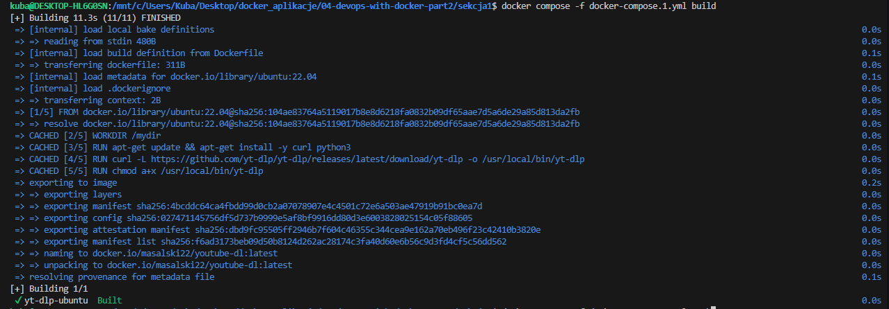

[Docker compose](docker-compose.1.yml)

# Wolumeny w Docker Compose

> Polecenie `docker compose -f docker-compose.2.yml build`

> Polecenie `docker compose -f docker-compose.2.yml run yt-dlp-ubuntu https://imgur.com/JY5tHqr`

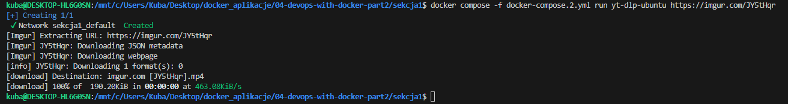

[Pobrany plik](imgur.com%20[JY5tHqr].mp4)

[Docker compose 2](docker-compose.2.yml)

### Ćwiczenie 2.1

> Polecenie `docker compose -f docker-compose.3.yml build`

> Polecenie `docker compose -f docker-compose.3.yml up`

[Docker compose 3](docker-compose.3.yml)

[Tekst log](text.log)

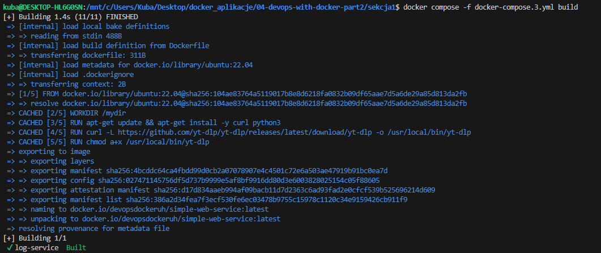

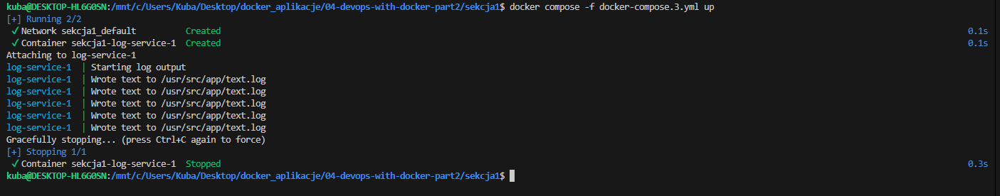

### Usługi webowe w Docker Compose

> Polecenie : `docker container run -d -p 8000:8000 jwilder/whoami`

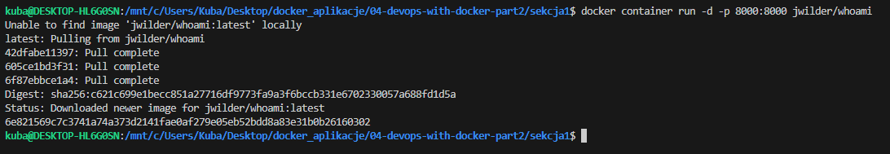
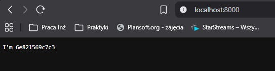

> Polecenie : `docker container stop 6e821569c7c3741a74a373d2141fae0af279e05eb52bdd8a83e31b0b26160302`

> Polecenie : `docker container rm 6e821569c7c3741a74a373d2141fae0af279e05eb52bdd8a83e31b0b26160302`

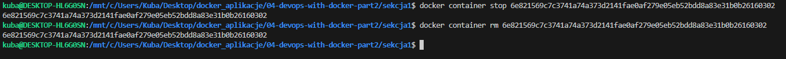

> Polecenie : `docker compose up -d`

> Polecenie : `curl localhost:8000`

[Docker compose](./whoami/docker-compose.yml)

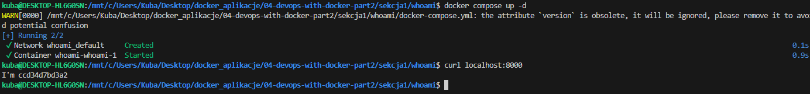

## Ćwiczenia 2.2 - 2.3

### Ćwiczenia 2.2

> Polecenie : `docker compose -f docker-compose.4.yml up`

[Docker compose](docker-compose.4.yml)

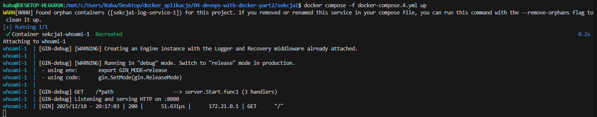
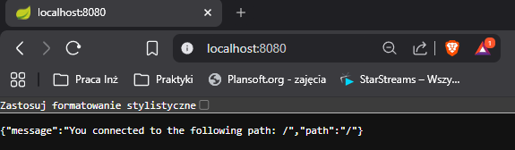

### Ćwiczenia 2.3

> Polecenie : `docker compose build`

> Polecenie : `docker compose up`

[Docker compose](./cw2.3/docker-compose.yml)

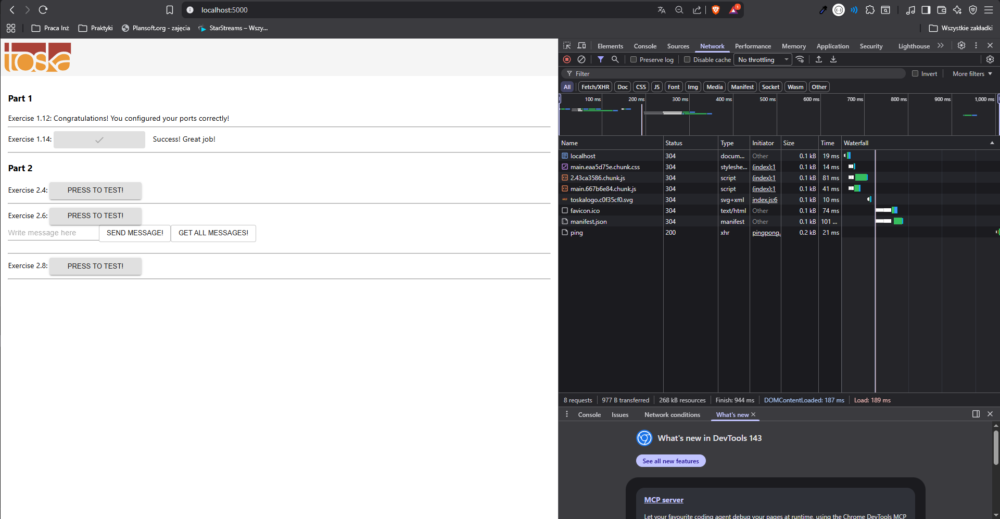
