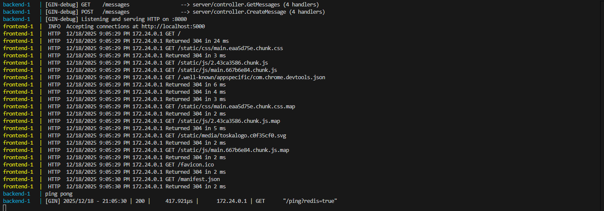
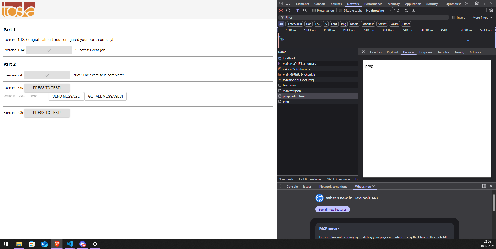
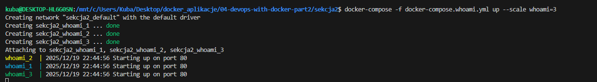
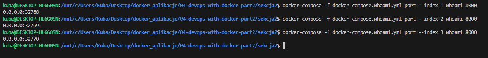
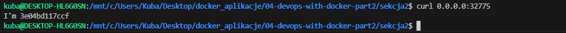
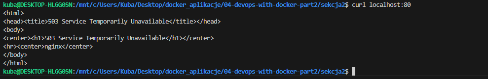
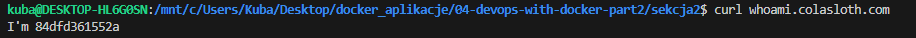
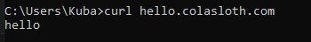
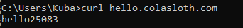
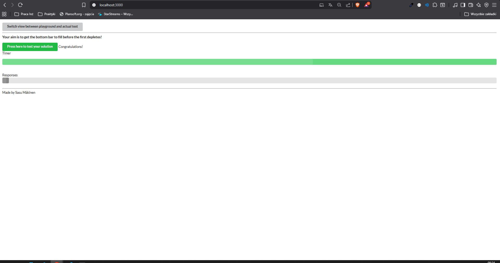

# Sekcja 2

## Sieci Dockera

### Ćwiczenie 2.4

[docker compose](./cw2.4/docker-compose.yml)

### Skalowanie

[Docker compose](docker-compose.whoami.yml)

> Polecenie : `docker-compose -f docker-compose.whoami.yml up --scale whoami=3`

> Polecenie : `docker-compose -f docker-compose.whoami.yml port --index 1 whoami 8000`

> Polecenie : `docker-compose -f docker-compose.whoami.yml port --index 2 whoami 8000`

> Polecenie : `docker-compose -f docker-compose.whoami.yml port --index 3 whoami 8000`

> Polecenie : `curl localhost:80`

> Polecenie : `curl whoami.colasloth.com`

Zmiania działa bez restartu kontenera

### Ćwiczenie 2.5
> Polecenie : `docker-compose up --scale compute=3`

