# Sekcja 3

### Wolumeny w praktyce

[Docker compose](docker-compose.yml)

> Polecenie `docker compose up`

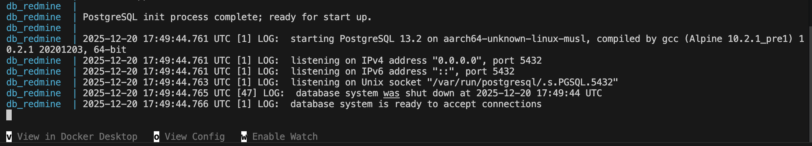

> Polecenie `docker container inspect db_redmine | grep -A 5 Mounts`

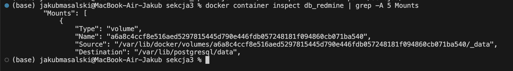

> Polecenie `docker volume ls`

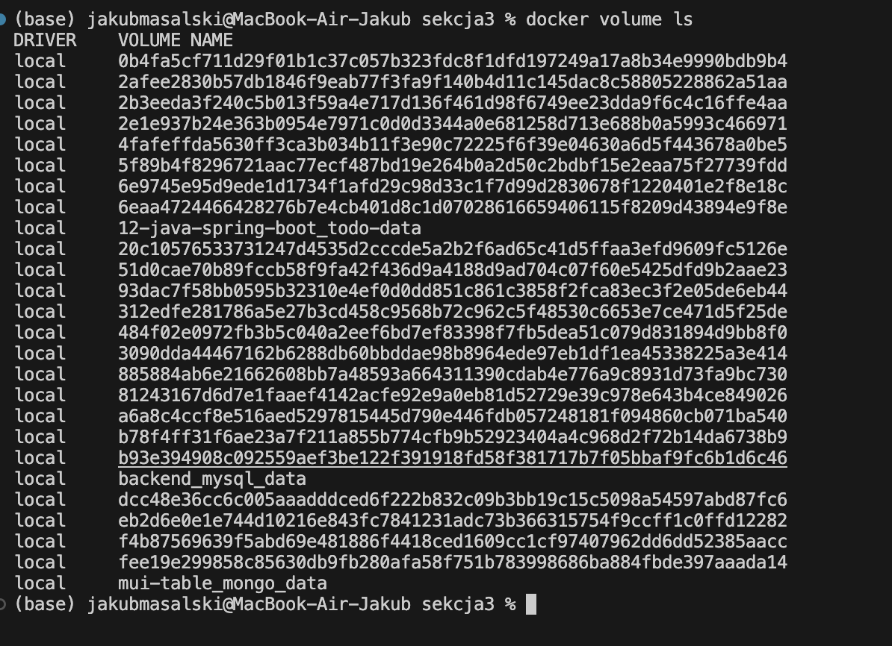

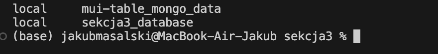

> Polecenie `docker container inspect db_redmine | grep -A 5 Mounts`

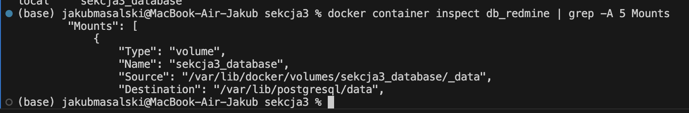

> Polecenie `docker compose up`

Migracje
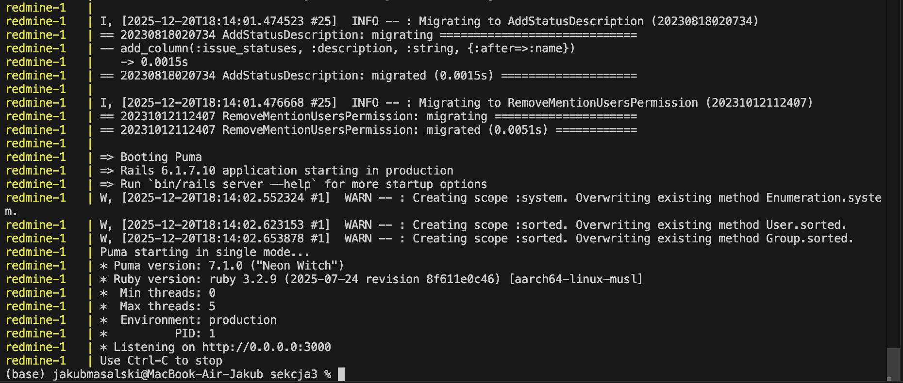

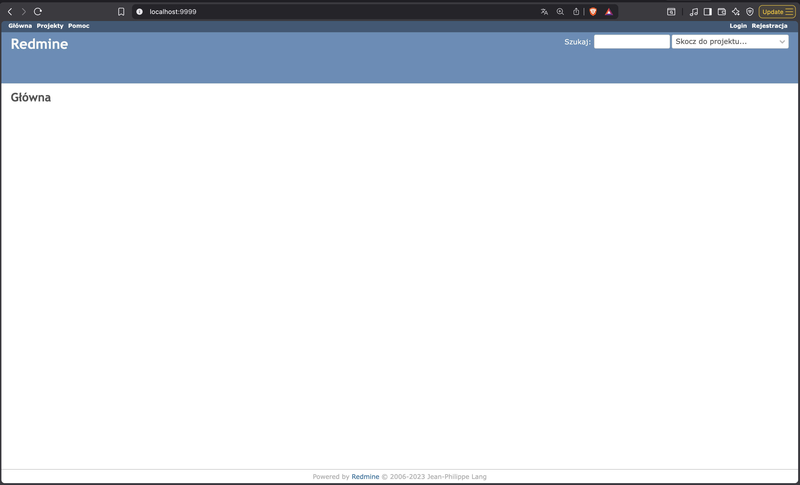

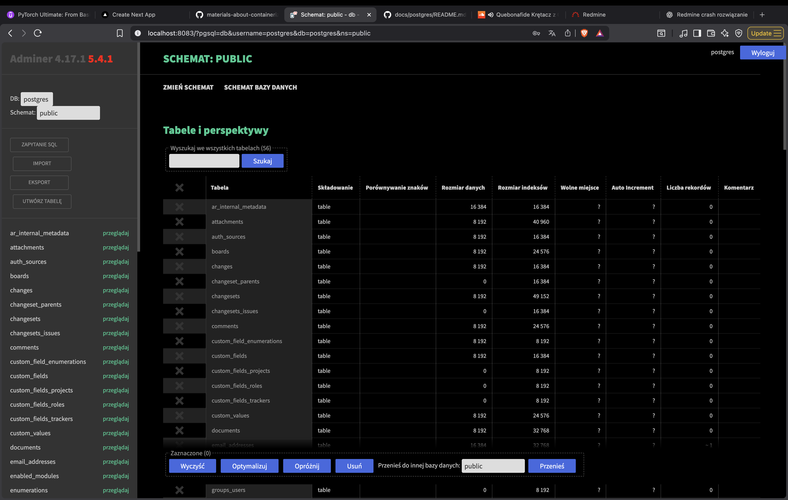

### Ćwczienie 2.6

[Docker compose](./cw2.5/docker-compose.yml)

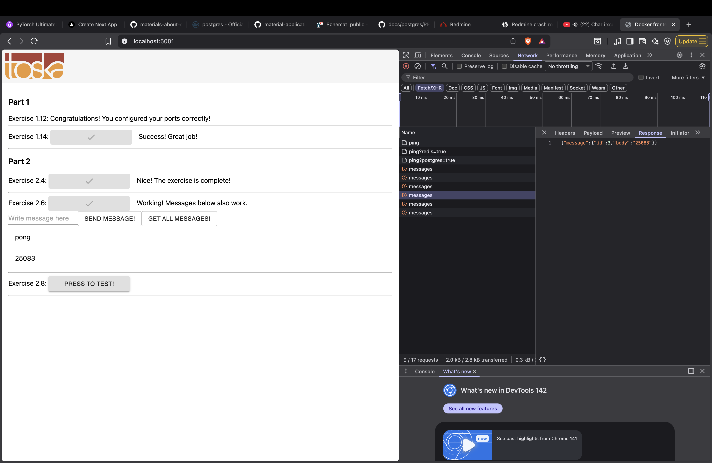

### Ćwczienie 2.7

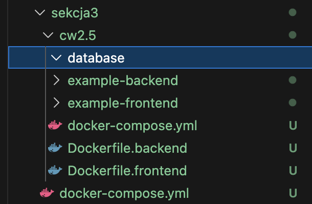

Po restarcie docker compose
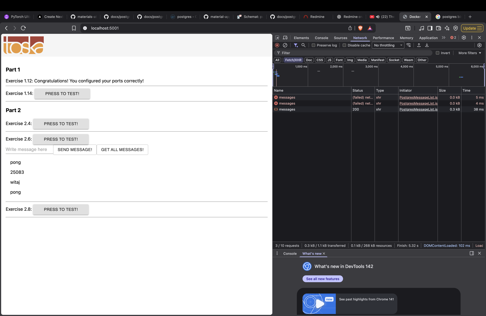

### Ćwczienie 2.8 i 2.9 (Wszystko działa)

[ngnix.conf](./cw2.5/nginx.conf)

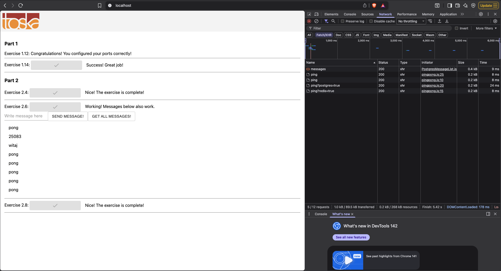

### Ćwiczenie 2.10

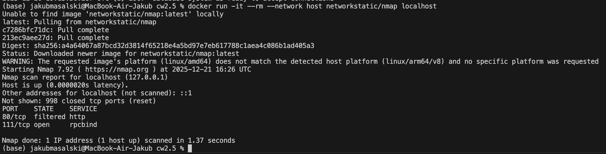
