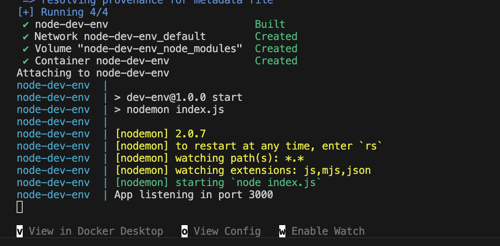
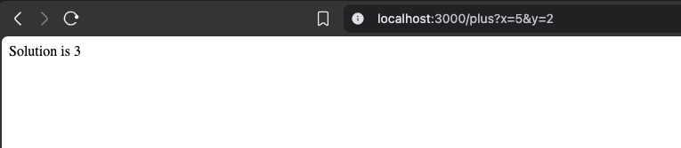
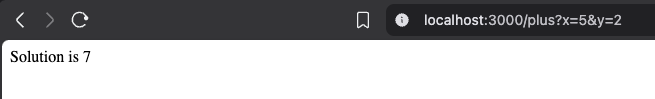

# Sekcja 4

### Kontenery w środowisku deweloperskim

> Polecenie : `docker compose up` 

Po wykonaniu zmiany w kodzie - kontener sie zrestartował

### Ćwiczenei 2.10 

W projekcie inżynierskim wykorzystałem Docker Compose do skonteneryzowania bazy danych MySQL w środowisku deweloperskim. Przygotowana konfiguracja umożliwia szybkie uruchomienie bazy wraz z inicjalizacją danych, mapowaniem portu oraz trwałym wolumenem na dane. Rozwiązanie zapewnia powtarzalność środowiska i eliminuje zależność od lokalnej instalacji bazy danych.

[Docker compose](https://github.com/JMasalski/inzynierka225Ic/blob/master/backend/docker-compose.dev.yml)