# Sekcja 2

### Własny pipeline

### Ćwiczenie 3.1 

Do repozytorium musiałem dodać secret variables (DOCKERHUB-name i DOCKERHUB-TOKEN)

[Deploy.yml](../../../docker_aplikacje/.github/workflows/deploy.yml)

[Dockerhub Link](https://hub.docker.com/r/masalski22/express-app)

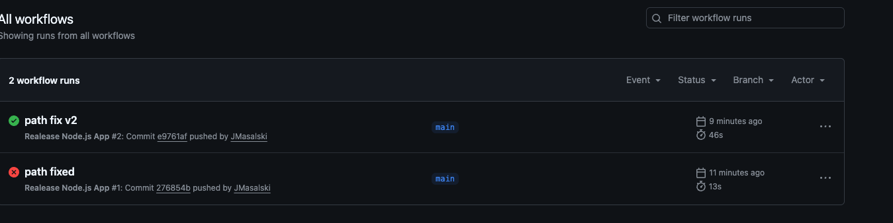
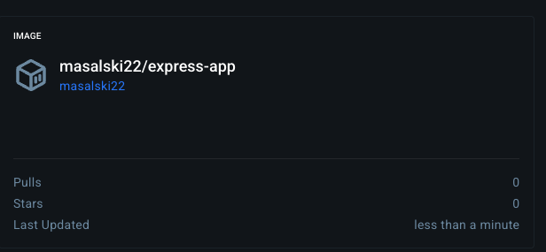

Docker compose z watchtowerem

[Dockerhub Compose](docker-compose.yml)

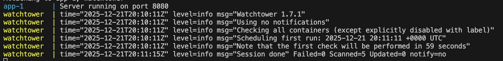
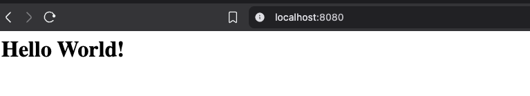

Wykrecie i zmian i automatyczna aktualizacja

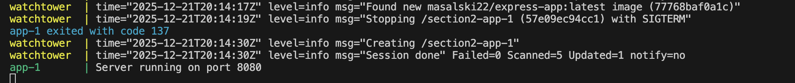
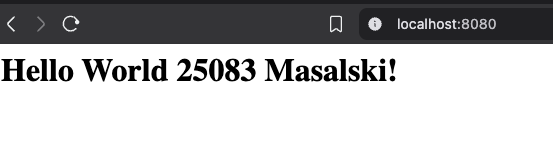

### Ćwiczenie 3.2

[Aplikacja na fly.io](https://simpleproject.fly.dev/)

[fly-deploy.yml](../../../docker_aplikacje/.github/workflows/fly-deploy.yml)

Próby deployu
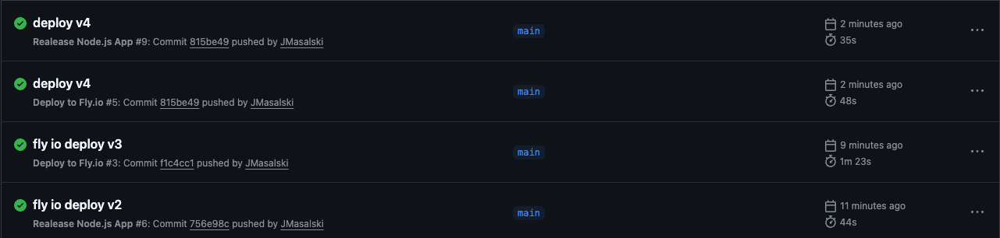

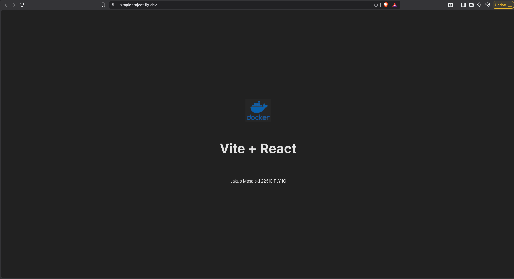

### Ćwiczenie 3.3

[Skrypt](builder.sh)

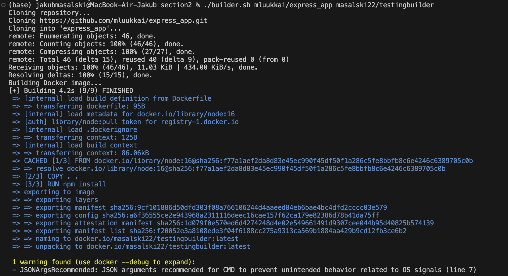

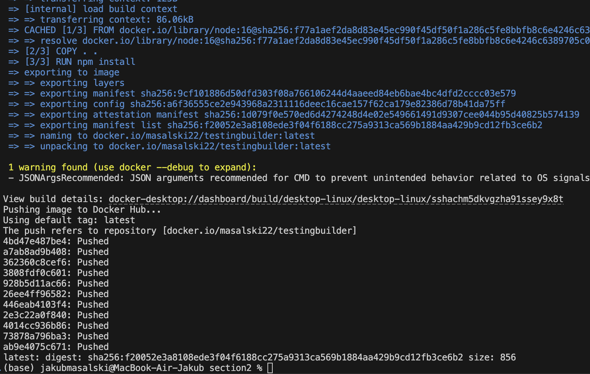

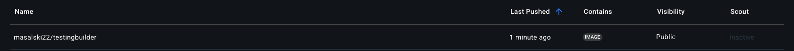

### Ćwcizenie 3.4 

[Repo na docker hub](https://hub.docker.com/r/masalski22/testing34)

[Builder](3.4%20task/builder.sh)

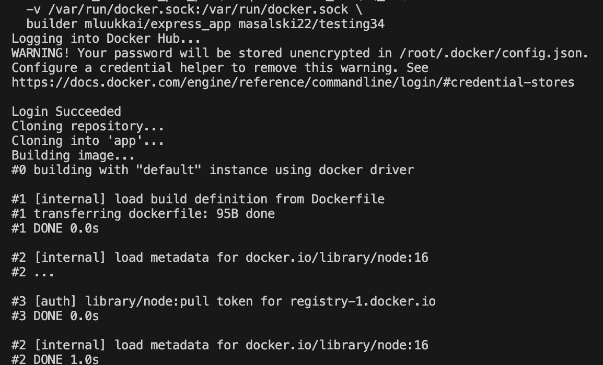
