# Sekcja 4

### Optimizing the image size

Dockerfile przed optymalizacją

[Dockerfile](Dockerfile.beforeOptimization)
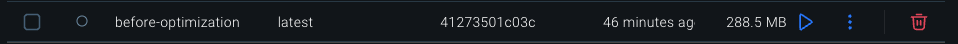

Dockerfile po optymalizacji

[Dockerfile](Dockerfile.afterOptimization)
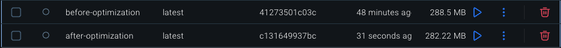

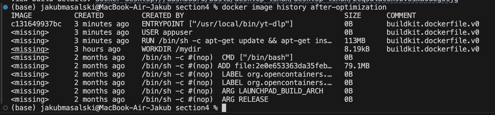

Dockerfile po optymalizacji v2

[Dockerfile](Dockerfile.afterOptimizationv2)
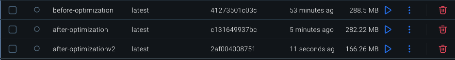

Dockerfile po optymalizacji v3

[Dockerfile](Dockerfile.afterOptimizationv3)
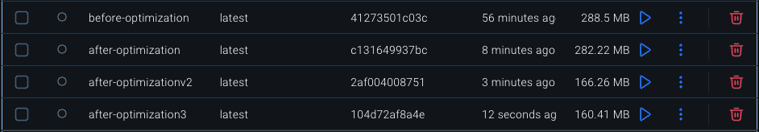

Rónica ≈ 128MB

### Ćwiczenie 3.6

Obrazy przed optymalizacją

[Dockerfile.frontend](cw3.6/Dockerfile.frontendBeforeOptimization)

[Dockerfile.backend](cw3.6/Dockerfile.backendBeforeOptimization)

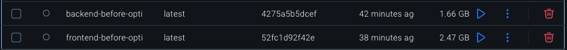

Obrazy po optymalizacji

[Dockerfile.frontend](cw3.6/Dockerfile.frontendAfterOptimization)

[Dockerfile.backend](cw3.6/Dockerfile.backendAfterOptimization)

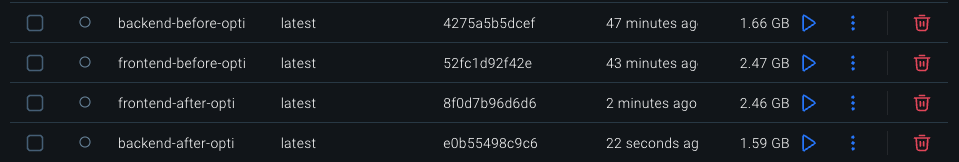

### Alpine Linux variant

Dockerfile po optymalizacji v3

[Dockerfile](Dockerfile.afterOptimizationv4)
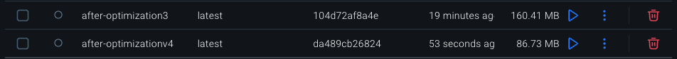
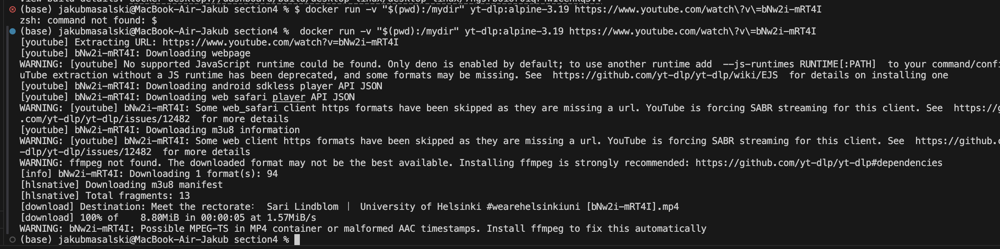
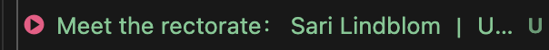

### Image with preinstalled environment

Dockerfile z środowiskiem Python

[Dockerfile](Dockerfile.pythonENV)
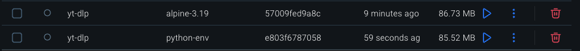

### Ćwiczenie 3.7

Obrazy alpine

[Dockerfile.frontend](cw3.6/Dockerfile.frontendAlpine)

[Dockerfile.backend](cw3.6/Dockerfile.backendAlpine)

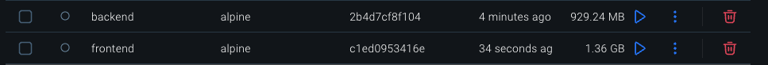

### Multi-stage builds

[Dockerfile](Multi-stage-builds/Dockerfile)
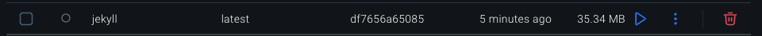

### Ćwiczenie 3.8, 3.9

Obrazy po optymalizacji

[Dockerfile.frontend](cw3.6/Dockerfile.frontendMultiStage)

[Dockerfile.backend](cw3.6/Dockerfile.backendMultiStage)

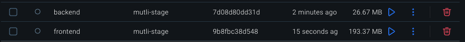